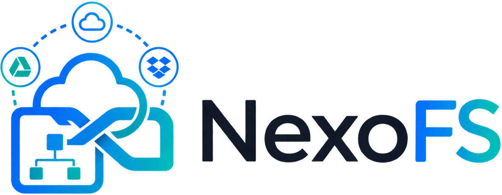

<picture>
  <source media="(prefers-color-scheme: dark)" srcset="assets/branding/Logo_NexoFS_sem_fundo_escuro.png">
  
</picture>

**Todas as suas nuvens em um único filesystem.**

NexoFS monta contas de nuvem (OneDrive, Google Drive) como um sistema de arquivos [FUSE](https://www.kernel.org/doc/html/latest/filesystems/fuse.html) local no Linux — os arquivos aparecem como pastas comuns, com sincronização incremental, cache de conteúdo, fixação seletiva para uso offline, exclusões estilo `.gitignore` e resolução de conflitos completa.


🌐 **[Site do projeto](https://jerthon.github.io/nexofs/)** · 📦 **[Downloads (.deb/.rpm), separados por versão](site/downloads/)**

## Funcionalidades

- **Multi-provedor**: OneDrive e Google Drive hoje, arquitetura pronta para novos provedores (`CloudProvider` trait — ver [ADR-006](docs/adr/0006-provider-neutral-core.md)).
- **Indexação preguiçosa**: nada é baixado ou listado até que o usuário navegue até lá — sem varredura inicial de nuvens gigantes ([ADR-008](docs/adr/0008-lazy-indexing-por-padrao.md)).
- **Fixação seletiva (pin)**: qualquer arquivo ou pasta pode ser marcado para ficar sempre disponível offline; o resto permanece "só na nuvem" até ser aberto.
- **Cache de conteúdo local** com contabilização por conta (limpo / modificado / parcial / mantido localmente).
- **Exclusões estilo `.gitignore`**, com perfis sugeridos automaticamente a partir de manifestos do projeto (`package.json`, `Cargo.toml`, etc.).
- **Resolução de conflitos nunca-silenciosa**: nenhuma escrita concorrente é descartada sem o usuário decidir o que fazer ([ADR-012](docs/adr/0012-conflitos-nunca-sobrescrevem-silenciosamente.md)).
- **Interface desktop** (Tauri) com abas para contas, arquivos, exclusões, operações, conflitos, cache e log de sincronização em tempo real.
- **CLI de administração** (`nexofs`) para tudo que a interface gráfica faz, útil para servidores/scripts.
- **Daemon separado da UI** (`nexofsd`) — a sincronização continua rodando mesmo com a janela fechada ([ADR-005](docs/adr/0005-daemon-separado-da-ui.md)).

## Arquitetura

```
┌──────────────┐        socket local        ┌───────────┐
│ nexofs-desktop│◄──────────────────────────►│           │
│   (Tauri/UI)  │                             │           │
└──────────────┘                             │  nexofsd  │◄──── FUSE ────► ponto de montagem
┌──────────────┐        socket local         │ (daemon)  │
│  nexofs (CLI) │◄──────────────────────────►│           │◄──── HTTPS ───► OneDrive / Google Drive
└──────────────┘                             └───────────┘
```

O núcleo (`nexofs-sync-core`) não conhece OneDrive nem Google Drive diretamente — fala apenas com a trait `CloudProvider` (`nexofs-provider-api`), implementada por `nexofs-provider-onedrive` e `nexofs-provider-googledrive`. Todo tráfego externo passa por um *governor* central de taxa/circuit-breaker (`nexofs-api-governor`), e o índice local vive em SQLite com WAL (`nexofs-metadata-store`).

As decisões de design com o *porquê* de cada uma estão documentadas em [`docs/adr/`](docs/adr/) (Architecture Decision Records).

## Requisitos

- Linux com suporte a FUSE 3 (`fuse3` instalado).
- [Rust](https://rustup.rs/) (edição 2021) e Cargo.
- [Node.js](https://nodejs.org/) + npm, apenas para compilar a interface desktop.
- systemd com sessão de usuário (`systemctl --user`), para rodar o daemon como serviço.

## Instalação via pacote pronto

Pacotes `.deb` (Ubuntu/Debian) e `.rpm` (Fedora/RHEL) com tudo num único instalador — daemon (`nexofsd`), CLI (`nexofs`) e interface gráfica (`nexofs-desktop`) —, organizados por versão em [`site/downloads/`](site/downloads/) (também publicados em [GitHub Releases](https://github.com/jerthon/nexofs/releases)).

```bash
# Debian/Ubuntu
sudo apt install ./site/downloads/0.1.1/nexofs_0.1.1-1_amd64.deb

# Fedora/RHEL
sudo dnf install ./site/downloads/0.1.1/nexofs-0.1.1-1.fc44.x86_64.rpm
```

## Build a partir do código-fonte

```bash
# Daemon + CLI
cargo build --release -p nexofsd -p nexofs-cli

# Interface desktop (gera .deb e .rpm em desktop/src-tauri/target/release/bundle/)
cd desktop
npm install
cargo tauri build
```

Pacotes prontos (`.spec`/`debian/rules`) para RPM e DEB — com o daemon, a CLI e a interface gráfica no mesmo instalador — ficam em [`packaging/`](packaging/).

### Google Drive: credenciais do app

O `client_id`/`client_secret` do Google Drive pertencem ao *app* NexoFS, não a cada usuário — o app é registrado uma única vez no Google Cloud Console e as credenciais ficam embutidas no binário em tempo de compilação. Para gerar um build com Google Drive habilitado:

```bash
export NEXOFS_GOOGLEDRIVE_CLIENT_ID="..."
export NEXOFS_GOOGLEDRIVE_CLIENT_SECRET="..."
cargo build --release -p nexofsd
```

As mesmas variáveis também funcionam em tempo de *execução* como override (útil para quem quiser usar seu próprio projeto Google Cloud sem recompilar). Detalhes em [ADR-015](docs/adr/0015-google-drive-como-segundo-provedor.md).

## Uso

### Interface desktop

Abra "NexoFS" no menu de aplicativos, clique em **+ Adicionar conta**, escolha o provedor, o ponto de montagem e autentique. A janela some para a bandeja do sistema ao fechar — a sincronização continua em segundo plano via `nexofsd`.

### CLI

```bash
nexofs status                                   # visão geral: contas, filas, cache
nexofs accounts-add --provider onedrive         # adiciona conta (abre o navegador p/ login)
nexofs namespaces                               # contas montadas
nexofs pin <namespace_id> <item_id> --recursive # mantém disponível offline
nexofs conflicts                                # conflitos abertos
nexofs conflict-resolve <conflict_id> KEEP_LOCAL
```

Rode `nexofs --help` para o catálogo completo de comandos.

## Desenvolvimento

```bash
cargo test --workspace       # testes do backend
cd desktop && npm run dev    # UI em modo dev (hot reload)
cd desktop && cargo tauri dev
```
## Licença

[AGPL-3.0-or-later](https://www.gnu.org/licenses/agpl-3.0.html).
