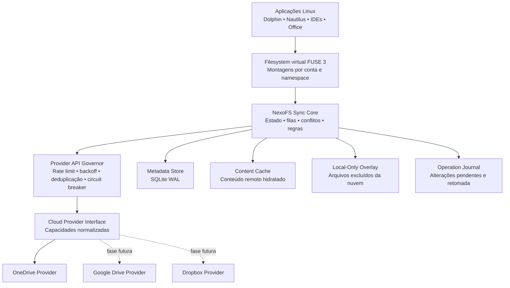
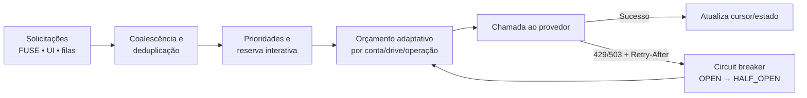
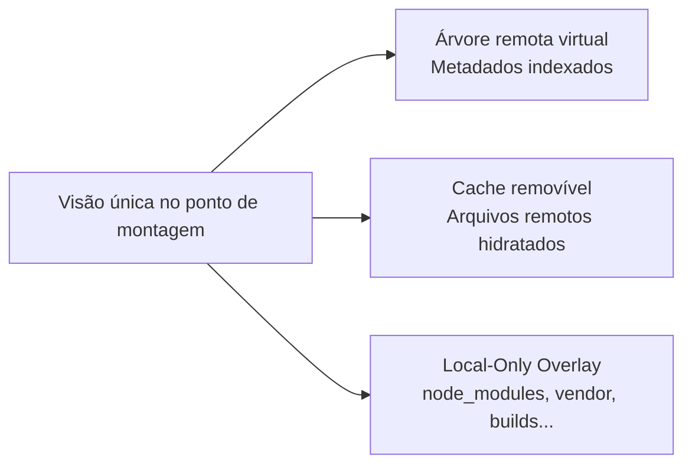
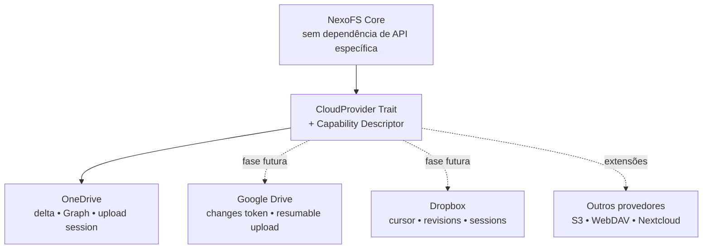
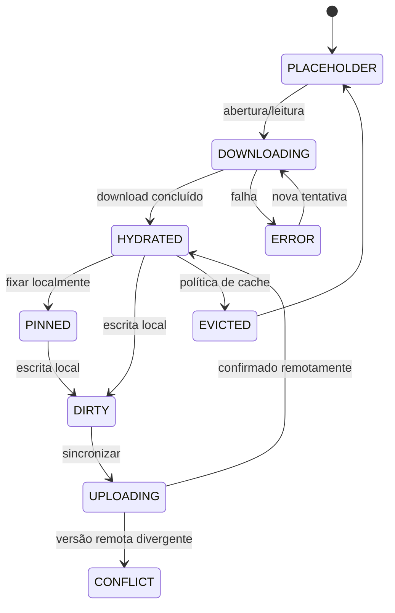

**NEXOFS**

**Product Requirements Document**

Filesystem virtual multi-cloud para Linux


**Versão 1.0**  
Status: PRD consolidado para planejamento e desenvolvimento  
Data: 23 de julho de 2026

**NexoFS**  
*Todas as suas nuvens em um único filesystem.*

> **Formato:** este arquivo utiliza Markdown compatível com GitHub e diagramas Mermaid. Em visualizadores sem suporte a Mermaid, o conteúdo textual e os requisitos permanecem integralmente legíveis.

# Controle do documento

| **Campo**            | **Valor**                                  |
|----------------------|--------------------------------------------|
| Produto              | NexoFS                                 |
| Documento            | Product Requirements Document (PRD)        |
| Versão               | 1.0                                        |
| Data                 | 23/07/2026                                 |
| Status               | Consolidado para validação e planejamento  |
| Plataformas iniciais | Fedora, Ubuntu e KDE Neon                  |
| Desktops iniciais    | GNOME e KDE Plasma, em Wayland e X11       |
| Provedor inicial     | Microsoft OneDrive pessoal e corporativo   |
| Provedores futuros   | Google Drive, Dropbox e outros adaptadores |

## Histórico de versões

| **Versão** | **Data**   | **Alterações**                                                                                                                                         |
|------------|------------|--------------------------------------------------------------------------------------------------------------------------------------------------------|
| 1.0        | 23/07/2026 | Consolidação do PRD base sob o nome NexoFS, incluindo governança de APIs, exclusões, Local-Only Overlay, arquitetura multi-cloud, compatibilidade GNOME/KDE e critérios de aceite. |

## Como ler este documento

Este PRD define o comportamento esperado do produto, os requisitos funcionais e não funcionais, as restrições de plataforma e os critérios de aceite. As decisões de baixo nível, contratos completos de APIs internas, esquemas definitivos de banco e algoritmos serão detalhados posteriormente em um SDD/TDD.

| **Prioridade —** Os requisitos usam a classificação Must, Should, Could e Won’t. “Must” é obrigatório para a entrega indicada; “Should” deve ser implementado salvo impedimento justificado; “Could” é desejável; “Won’t” está fora do escopo da versão. |
|----------------------------------------------------------------------------------------------------------------------------------------------------------------------------------------------------------------------------------------------------------|

# Sumário

- 1. Resumo executivo

- 2. Contexto, problema e oportunidade

- 3. Visão, princípios e objetivos

- 4. Personas e jornadas principais

- 5. Escopo e estratégia de releases

- 6. Requisitos funcionais

- 7. Proteção contra consumo excessivo de APIs

- 8. Exclusões, perfis de projeto e Local-Only Overlay

- 9. Arquitetura multi-cloud

- 10. Arquitetura técnica

- 11. Modelo de dados e estados

- 12. Segurança, privacidade e autenticação

- 13. Compatibilidade Linux e distribuição

- 14. Requisitos de experiência e interface

- 15. Requisitos não funcionais

- 16. Observabilidade, suporte e diagnóstico

- 17. Critérios de aceite

- 18. Estratégia de testes

- 19. Roadmap de desenvolvimento

- 20. Riscos e mitigações

- 21. Questões em aberto

- Apêndices: matriz de capacidades, glossário e referências

# 1. Resumo executivo

NexoFS será uma aplicação desktop e um serviço de usuário para Linux que apresentará contas de armazenamento em nuvem como filesystems montados localmente. O primeiro provedor será o Microsoft OneDrive, incluindo contas pessoais e corporativas. A arquitetura será preparada desde o início para Google Drive, Dropbox e provedores adicionais.

O produto não realizará um espelhamento integral obrigatório. A árvore de arquivos será representada por um índice local persistente; o conteúdo será baixado sob demanda, quando aberto, ou mantido permanentemente no dispositivo quando o usuário fixar um arquivo ou pasta. Alterações locais serão registradas de forma durável e enviadas em segundo plano.

A solução será projetada para repositórios muito grandes. Navegação repetida deverá ser atendida pelo índice local, sem reenumerar a nuvem. A descoberta de alterações usará cursores incrementais do provedor e será acionada de maneira controlada: quando o usuário estiver navegando na montagem, quando uma operação precisar validar consistência ou quando o usuário clicar em “Verificar atualizações”.

Um Provider API Governor obrigatório protegerá o serviço contra consumo excessivo, throttling e indisponibilidade temporária. Requisições serão consolidadas, priorizadas, limitadas e retomadas de acordo com Retry-After, backoff e circuit breaker. A interface continuará utilizável em modo degradado e nenhuma alteração local será perdida.

Para projetos de software e diretórios gerados, o NexoFS oferecerá regras de exclusão, perfis para tecnologias e um Local-Only Overlay. Diretórios como node_modules, vendor, .venv e target poderão existir dentro da montagem sem serem enviados à nuvem nem tratados como cache descartável.

| **Decisão central —** NexoFS deve ser construído como um filesystem virtual local-first, orientado a eventos e cursores de mudança — não como um processo periódico de cópia integral. |
|--------------------------------------------------------------------------------------------------------------------------------------------------------------------------------------------|

# 2. Contexto, problema e oportunidade

## 2.1 Problema

Usuários Linux que dependem de serviços de nuvem encontram soluções com limitações recorrentes: download integral, varreduras completas, alto uso de disco, comportamento inconsistente entre desktops, ausência de placeholders, tratamento inseguro de conflitos ou dependência de um único provedor.

- Repositórios com centenas de milhares ou milhões de itens tornam a enumeração completa lenta e cara.

- Sincronizar todo o conteúdo pode exceder o espaço local disponível.

- Ferramentas de desenvolvimento geram árvores enormes e descartáveis, como node_modules e vendor.

- Chamadas excessivas às APIs podem causar throttling e indisponibilidade temporária.

- Uma mudança remota concorrente pode ser sobrescrita sem detecção adequada.

- Soluções específicas de um desktop ou distribuição limitam a adoção corporativa.

## 2.2 Oportunidade

Existe espaço para uma solução Linux nativa, eficiente e extensível que combine filesystem virtual, cache sob demanda, sincronização incremental, operação offline, exclusões inteligentes e uma camada comum para vários provedores de nuvem.

## 2.3 Hipótese de produto

Se o NexoFS responder à navegação pelo índice local, hidratar conteúdo somente quando necessário, limitar rigorosamente as chamadas remotas e oferecer tratamento seguro de conflitos, então usuários individuais e corporativos poderão trabalhar com grandes repositórios de nuvem no Linux sem manter cópias completas nem sofrer degradação causada por polling e operações redundantes.

# 3. Visão, princípios e objetivos

## 3.1 Visão

Oferecer uma única camada de filesystem para acessar, editar e organizar arquivos de diferentes nuvens no Linux, preservando desempenho local, disponibilidade offline, segurança e controle explícito do usuário.

## 3.2 Princípios de produto

| **Princípio**              | **Aplicação no NexoFS**                                                                                                |
|----------------------------|----------------------------------------------------------------------------------------------------------------------------|
| Local-first                | Operações locais são persistidas antes da comunicação remota e podem continuar durante falhas de rede.                     |
| API-efficient              | Nenhuma chamada remota é feita fora do Provider API Governor; delta, deduplicação e coalescência são padrões obrigatórios. |
| Lazy by default            | Metadados e conteúdo são carregados progressivamente, conforme uso ou política explícita.                                  |
| No silent data loss        | Conflitos e exclusões nunca descartam silenciosamente versões locais ou remotas.                                           |
| Provider-neutral core      | O núcleo trabalha com capacidades genéricas, não com tipos ou nomes específicos do OneDrive.                               |
| Desktop-independent        | O funcionamento básico depende de POSIX/FUSE, não de extensões específicas do Nautilus ou Dolphin.                         |
| Observable and recoverable | Estado, filas e operações podem ser diagnosticados e retomados após falhas.                                                |

## 3.3 Objetivos

- Conectar múltiplas contas pessoais e corporativas.

- Montar cada conta ou namespace como diretório Linux.

- Navegar em grandes árvores sem baixar todos os arquivos.

- Baixar arquivos sob demanda e permitir fixação local.

- Sincronizar alterações locais e remotas com controle de versão.

- Evitar consumo excessivo de APIs e respeitar throttling.

- Oferecer exclusões robustas e persistência local para conteúdo não sincronizado.

- Funcionar em Fedora, Ubuntu e KDE Neon, com GNOME ou KDE Plasma.

- Adicionar novos provedores sem reescrever o motor de sincronização.

## 3.4 Indicadores de sucesso

| **Indicador**             | **Meta inicial**                                                                                 |
|---------------------------|--------------------------------------------------------------------------------------------------|
| Navegação por índice      | Mais de 95% das listagens repetidas atendidas sem chamada remota dentro do TTL.                  |
| Eficiência de atualização | No máximo uma consulta incremental em voo por drive/namespace.                                   |
| Segurança de dados        | Zero perda silenciosa em cenários de conflito ou falha simulada.                                 |
| Desempenho ocioso         | CPU média inferior a 1% sem transferências ou navegação ativa.                                   |
| Recuperação               | Operações pendentes retomadas após reinício sem intervenção manual, salvo conflito/autenticação. |
| Compatibilidade           | Critérios funcionais aprovados em Nautilus e Dolphin, Wayland e X11.                             |
| Extensibilidade           | Provider simulado e segundo adaptador adicionáveis sem alterar a máquina de estados principal.   |

## 3.5 Não objetivos do MVP

- Cliente para Windows ou macOS.

- Merge automático de documentos binários.

- Sincronização integral de ACLs POSIX, owners e groups.

- Suporte completo a hard links, device files, FIFOs e sockets.

- Compactar automaticamente projetos como substituto de sincronização transparente.

- Bibliotecas SharePoint arbitrárias no primeiro MVP, salvo decisão posterior.

- Edição colaborativa em tempo real.

# 4. Personas e jornadas principais

## 4.1 Personas

| **Persona**               | **Necessidade principal**                                                      | **Risco atual**                                             |
|---------------------------|--------------------------------------------------------------------------------|-------------------------------------------------------------|
| Usuário pessoal           | Acessar OneDrive no Linux sem baixar tudo.                                     | Espaço local insuficiente e ferramentas pouco integradas.   |
| Colaborador corporativo   | Usar OneDrive empresarial com autenticação organizacional.                     | Falhas de compatibilidade, conflitos e políticas de acesso. |
| Desenvolvedor             | Trabalhar em projetos dentro da montagem sem sincronizar dependências geradas. | Milhões de arquivos e consumo excessivo de API.             |
| Usuário com grande acervo | Pesquisar e navegar em repositório enorme.                                     | Indexação lenta, alta memória e polling contínuo.           |
| Administrador Linux       | Instalar, atualizar e diagnosticar de modo padronizado.                        | Diferenças entre distribuições, desktops e keyrings.        |

## 4.2 Jornadas críticas

### Conectar uma conta e começar a navegar

1.  Usuário adiciona a conta pela interface.

2.  Login ocorre no navegador do sistema com OAuth 2.0 e PKCE.

3.  NexoFS obtém a raiz, cria o cursor de mudanças e monta o filesystem.

4.  A raiz fica disponível antes de uma indexação completa.

5.  Pastas são carregadas conforme a navegação.

### Abrir um arquivo somente online

6.  A aplicação executa open/read no ponto de montagem.

7.  O índice indica que o conteúdo ainda não está hidratado.

8.  O download interativo recebe prioridade e passa pelo governador.

9.  O conteúdo é gravado em arquivo temporário, validado e promovido atomicamente.

10. O handle é entregue à aplicação e o arquivo permanece elegível ao cache.

### Trabalhar em projeto Node.js ou Laravel

11. NexoFS detecta package.json ou composer.json e sugere um perfil.

12. O usuário confirma a exclusão de node_modules ou vendor.

13. As dependências são criadas no Local-Only Overlay.

14. Nenhuma operação remota ou hash de sincronização é gerado para esse conteúdo.

15. O código-fonte normal continua sincronizado.

### Resolver conflito

16. Upload valida a versão remota de base.

17. Se a versão mudou e o conteúdo local também está dirty, o item entra em CONFLICT.

18. A interface apresenta metadados das duas versões.

19. O usuário escolhe manter local, nuvem ou ambas.

20. A decisão é registrada e executada de forma idempotente.

# 5. Escopo e estratégia de releases

| **Release**          | **Escopo principal**                                                            |
|----------------------|---------------------------------------------------------------------------------|
| PoC técnico          | Autenticação, FUSE read-only, SQLite, raiz, hidratação e detecção de atividade. |
| MVP de leitura       | Navegação progressiva, delta, cache, atualização manual, múltiplas contas.      |
| MVP de escrita       | Journal, uploads, create/move/rename/delete, modo offline e retomada.           |
| MVP completo         | Fixação, exclusões, Local-Only Overlay, conflitos, RPM/DEB e UI consolidada.    |
| Escala e ecossistema | Milhões de itens, ranges, plugins de gerenciador e segundo provedor.            |

| **Escopo do provedor inicial —** O produto inicia com OneDrive pessoal e corporativo. O núcleo, banco, journal e UX devem usar nomenclatura genérica para evitar uma migração arquitetural quando Google Drive e Dropbox forem adicionados. |
|---------------------------------------------------------------------------------------------------------------------------------------------------------------------------------------------------------------------------------------------|

# 6. Requisitos funcionais

## 6.1 Gerenciamento de contas e namespaces

| **ID**     | **Requisito**                                                                       | **Prioridade** | **Critério de aceite**                                    |
|------------|-------------------------------------------------------------------------------------|----------------|-----------------------------------------------------------|
| FR-ACC-001 | Adicionar conta OneDrive pessoal por OAuth delegado com PKCE.                       | Must           | Conta conectada sem client secret embutido.               |
| FR-ACC-002 | Adicionar conta OneDrive corporativa e respeitar políticas do tenant.               | Must           | Login e acesso ao drive do usuário concluídos.            |
| FR-ACC-003 | Manter várias contas ativas com pontos de montagem independentes.                   | Must           | Duas contas operam simultaneamente sem colisão de estado. |
| FR-ACC-004 | Pausar, retomar, reautenticar e desconectar uma conta.                              | Must           | Ações refletidas no daemon e na UI.                       |
| FR-ACC-005 | Representar futuramente múltiplos namespaces por conta, como drives compartilhados. | Should         | Modelo e API local não assumem um único drive.            |
| FR-ACC-006 | Permitir configuração de proxy e certificados corporativos.                         | Should         | Conexão validada em proxy autenticado ou CA corporativa.  |

## 6.2 Montagem e filesystem virtual

| **ID**    | **Requisito**                                                                                                                      | **Prioridade** | **Critério de aceite**                               |
|-----------|------------------------------------------------------------------------------------------------------------------------------------|----------------|------------------------------------------------------|
| FR-FS-001 | Montar cada conta/namespace com FUSE 3 no contexto do usuário.                                                                     | Must           | Montagem disponível sem daemon privilegiado.         |
| FR-FS-002 | Suportar lookup, getattr, opendir, readdir, open, read, write, flush, fsync, release, create, mkdir, rename, move, unlink e rmdir. | Must           | Suite POSIX básica aprovada.                         |
| FR-FS-003 | Responder metadados pelo índice local sempre que válidos.                                                                          | Must           | Navegação repetida não gera chamada remota.          |
| FR-FS-004 | Manter inodes estáveis por identidade remota, não por caminho.                                                                     | Must           | Rename/move preserva inode quando possível.          |
| FR-FS-005 | Retornar ENOTSUP ou erro equivalente para operações sem representação segura.                                                      | Must           | Sem simulação silenciosa de hard links/device files. |
| FR-FS-006 | Continuar montado durante indisponibilidade do provedor.                                                                           | Must           | Índice e conteúdo local continuam acessíveis.        |

## 6.3 Índice local e carregamento progressivo

| **ID**     | **Requisito**                                                                             | **Prioridade** | **Critério de aceite**                                   |
|------------|-------------------------------------------------------------------------------------------|----------------|----------------------------------------------------------|
| FR-IDX-001 | Persistir metadados, relações pai-filho, versões, estados, cursores e operações.          | Must           | Estado preservado após reinício.                         |
| FR-IDX-002 | Carregar raiz antes de qualquer varredura ampla.                                          | Must           | Usuário navega logo após conexão.                        |
| FR-IDX-003 | Carregar filhos somente quando a pasta for acessada ou pré-indexada explicitamente.       | Must           | Pastas não visitadas não são enumeradas individualmente. |
| FR-IDX-004 | Usar cursor “a partir de agora” quando o provedor permitir, preservando indexação lazy.   | Must           | Mudanças futuras capturadas sem scan integral inicial.   |
| FR-IDX-005 | Reconstruir caminho pela relação pai-filho e cachear caminhos derivados.                  | Must           | Rename de pasta não atualiza todos os descendentes.      |
| FR-IDX-006 | Reconciliar índice em caso de cursor inválido sem apagar imediatamente a visão existente. | Should         | Usuário mantém acesso durante ressincronização.          |

## 6.4 Detecção de navegação ativa

O requisito de “verificar somente quando o gerenciador de arquivos estiver aberto” será implementado como uma política de atividade interativa. O FUSE fornece contexto de processo para as operações; o daemon poderá correlacionar o PID com executáveis conhecidos, diferenciar gerenciadores de arquivos de indexadores e manter uma sessão de pasta ativa.

| **ID**     | **Requisito**                                                                                          | **Prioridade** | **Critério de aceite**                                      |
|------------|--------------------------------------------------------------------------------------------------------|----------------|-------------------------------------------------------------|
| FR-ACT-001 | Detectar atividade por opendir, readdir, lookup, getattr e abertura de arquivos.                       | Must           | A pasta recebe last_active_at e TTL.                        |
| FR-ACT-002 | Identificar, quando possível, processos conhecidos como Nautilus e Dolphin pelo contexto FUSE e /proc. | Should         | Modo browser-aware aprovado nos desktops suportados.        |
| FR-ACT-003 | Ignorar ou reduzir peso de thumbnailers, indexadores e scanners conhecidos.                            | Should         | Background não mantém refresh continuamente ativo.          |
| FR-ACT-004 | Aplicar debounce e intervalo mínimo por drive, não por pasta.                                          | Must           | Várias pastas abertas geram uma única consulta incremental. |
| FR-ACT-005 | Disponibilizar políticas: browser-aware, qualquer acesso, periódico e manual somente.                  | Should         | Usuário seleciona comportamento por conta.                  |
| FR-ACT-006 | Usar 60 s como TTL inicial e 30 s como intervalo mínimo inicial, ambos configuráveis.                  | Should         | Configuração aplicada sem reiniciar o daemon.               |

| **Limitação controlada —** A detecção exata de uma janela visível não é portável entre todos os gerenciadores. O requisito será atendido por contexto de processo + operações FUSE + TTL, com modo manual como fallback determinístico. |
|-----------------------------------------------------------------------------------------------------------------------------------------------------------------------------------------------------------------------------------------|

## 6.5 Atualização manual e incremental

| **ID**     | **Requisito**                                                                         | **Prioridade** | **Critério de aceite**                                    |
|------------|---------------------------------------------------------------------------------------|----------------|-----------------------------------------------------------|
| FR-REF-001 | Exibir botão global “Verificar atualizações”.                                         | Must           | Ação consulta todas as contas elegíveis.                  |
| FR-REF-002 | Exibir botão por conta/namespace.                                                     | Must           | Somente o alvo selecionado é consultado.                  |
| FR-REF-003 | Consolidar cliques repetidos e reutilizar consulta já em andamento.                   | Must           | Uma chamada em voo por chave de deduplicação.             |
| FR-REF-004 | Usar sempre cursor incremental válido; scan completo apenas em recuperação explícita. | Must           | Operação normal não reconstrói a árvore.                  |
| FR-REF-005 | Mostrar última verificação, status e eventual Retry-After.                            | Must           | UI distingue atualizado, aguardando, erro e autenticação. |
| FR-REF-006 | Invalidar somente diretórios/inodes afetados pelas mudanças.                          | Must           | Árvore não é remontada.                                   |

## 6.6 Hidratação e leitura sob demanda

| **ID**     | **Requisito**                                                  | **Prioridade** | **Critério de aceite**                                 |
|------------|----------------------------------------------------------------|----------------|--------------------------------------------------------|
| FR-HYD-001 | Baixar conteúdo ao primeiro open/read de placeholder.          | Must           | Arquivo abre após download íntegro.                    |
| FR-HYD-002 | Usar arquivo temporário, validação e promoção atômica.         | Must           | Conteúdo parcial nunca aparece como completo.          |
| FR-HYD-003 | Dar prioridade máxima a downloads interativos.                 | Must           | Indexação não bloqueia abertura.                       |
| FR-HYD-004 | Retomar downloads quando o provedor suportar ranges.           | Should         | Transferência interrompida continua do ponto possível. |
| FR-HYD-005 | Implementar cache por ranges e sparse files em fase posterior. | Could          | Arquivo grande pode ser lido parcialmente.             |

## 6.7 Escrita local, journal e upload

| **ID**    | **Requisito**                                                                | **Prioridade** | **Critério de aceite**                         |
|-----------|------------------------------------------------------------------------------|----------------|------------------------------------------------|
| FR-UP-001 | Persistir conteúdo local e operação no journal antes do upload.              | Must           | Queda após close não perde alteração.          |
| FR-UP-002 | Executar upload em segundo plano, mesmo com UI fechada ou pasta inativa.     | Must           | Daemon conclui fila autonomamente.             |
| FR-UP-003 | Aplicar janela de estabilização e preferir close/fsync para reduzir uploads. | Must           | Múltiplas gravações geram uma versão final.    |
| FR-UP-004 | Usar upload retomável para arquivos grandes quando disponível.               | Must           | Sessão e progresso persistidos.                |
| FR-UP-005 | Coalescer create+write, múltiplos renames e create+delete.                   | Must           | Operações redundantes eliminadas antes da API. |
| FR-UP-006 | Validar versão remota antes de commit destrutivo.                            | Must           | Mudança concorrente vira conflito.             |

## 6.8 Disponibilidade local e fixação

| **ID**     | **Requisito**                                                                    | **Prioridade** | **Critério de aceite**                               |
|------------|----------------------------------------------------------------------------------|----------------|------------------------------------------------------|
| FR-PIN-001 | Oferecer estados Somente online, Disponível localmente e Sempre disponível.      | Must           | Estado visível e persistente.                        |
| FR-PIN-002 | Aplicar fixação recursiva a pastas sem bloquear a UI.                            | Must           | Descendentes hidratados em fila de baixa prioridade. |
| FR-PIN-003 | Nunca remover itens fixados, dirty, em conflito ou abertos.                      | Must           | Eviction respeita flags de proteção.                 |
| FR-PIN-004 | Atualizar item fixado quando houver refresh ativo/manual ou operação necessária. | Must           | Versão local converge sem polling irrestrito.        |

## 6.9 Cache local

| **ID**       | **Requisito**                                                                  | **Prioridade** | **Critério de aceite**                        |
|--------------|--------------------------------------------------------------------------------|----------------|-----------------------------------------------|
| FR-CACHE-001 | Permitir quota máxima e espaço mínimo livre.                                   | Must           | Eviction inicia antes de esgotar disco.       |
| FR-CACHE-002 | Usar LRU como política inicial, com extensibilidade para custo de re-download. | Must           | Itens antigos e elegíveis removidos primeiro. |
| FR-CACHE-003 | Separar cache clean, dirty, partial, conflict e Local-Only Overlay.            | Must           | Cada categoria possui política própria.       |
| FR-CACHE-004 | Permitir limpeza manual por conta e global.                                    | Must           | Somente conteúdo elegível é removido.         |
| FR-CACHE-005 | Exibir uso do banco, cache e overlay separadamente.                            | Should         | Usuário entende o consumo de disco.           |

## 6.10 Conflitos

| **ID**     | **Requisito**                                                                                                | **Prioridade** | **Critério de aceite**                   |
|------------|--------------------------------------------------------------------------------------------------------------|----------------|------------------------------------------|
| FR-CON-001 | Detectar conteúdo alterado nos dois lados, exclusão concorrente, rename/move concorrente e colisão de nomes. | Must           | Cenários de teste geram estado CONFLICT. |
| FR-CON-002 | Preservar versões local e remota até decisão.                                                                | Must           | Nenhuma versão é sobrescrita.            |
| FR-CON-003 | Oferecer manter local, manter nuvem, manter ambas e salvar cópia.                                            | Must           | Ações executadas de modo idempotente.    |
| FR-CON-004 | Gerar nome único, legível e válido ao manter ambas.                                                          | Must           | Extensão preservada e sem colisão.       |
| FR-CON-005 | Permitir adiar resolução e manter item protegido do eviction.                                                | Must           | Conflito permanece recuperável.          |

## 6.11 Modo offline

| **ID**     | **Requisito**                                                      | **Prioridade** | **Critério de aceite**                 |
|------------|--------------------------------------------------------------------|----------------|----------------------------------------|
| FR-OFF-001 | Navegar em pastas indexadas sem rede.                              | Must           | readdir/getattr funcionam pelo SQLite. |
| FR-OFF-002 | Abrir e editar arquivos hidratados.                                | Must           | Alteração entra no journal.            |
| FR-OFF-003 | Criar, mover, renomear e excluir localmente com replay posterior.  | Must           | Operações retomadas após reconexão.    |
| FR-OFF-004 | Exibir mensagem clara ao abrir placeholder sem rede.               | Must           | Erro não sugere corrupção.             |
| FR-OFF-005 | Detectar reconexão e retomar gradualmente, respeitando governador. | Must           | Sem rajada descontrolada.              |

## 6.12 Interface, bandeja e CLI

| **ID**    | **Requisito**                                                                                      | **Prioridade** | **Critério de aceite**                          |
|-----------|----------------------------------------------------------------------------------------------------|----------------|-------------------------------------------------|
| FR-UI-001 | Tela principal com contas, montagens, status, última verificação, filas, conflitos e uso de disco. | Must           | Dados atualizados pelo daemon.                  |
| FR-UI-002 | Área de transferências com progresso, velocidade, tentativas, pausa/cancelamento quando seguro.    | Must           | Usuário acompanha operações.                    |
| FR-UI-003 | Integração com bandeja quando o desktop suportar StatusNotifierItem.                               | Should         | GNOME/KDE funcionam com mecanismos disponíveis. |
| FR-UI-004 | CLI para status, mount, refresh, accounts, conflicts e diagnostics.                                | Should         | Admin opera sem UI gráfica.                     |
| FR-UI-005 | Extensões opcionais para menus e emblemas de Nautilus/Dolphin.                                     | Could          | Core continua funcional sem plugins.            |



*Figura 1 — Arquitetura funcional consolidada do NexoFS.*

# 7. Proteção contra consumo excessivo de APIs

O Provider API Governor é um requisito estrutural. Nenhum componente pode chamar diretamente um provedor remoto. Até operações de alta prioridade e atualização manual passam pelo mesmo controle, com prioridade diferente, mas sem bypass.

## 7.1 Escopos de orçamento

O estado de limitação deve ser separado, quando aplicável, por provedor, conta, tenant, namespace/drive e classe de operação. Isso evita que uma indexação de baixa prioridade monopolize a capacidade necessária para abrir um arquivo ou concluir uma alteração local.

```text
provider + account + tenant? + namespace + operation_class

operation_class:
- INTERACTIVE_METADATA
- INTERACTIVE_DOWNLOAD
- CHANGE_TRACKING
- SYNC_UPLOAD
- REMOTE_MUTATION
- BACKGROUND_INDEX
- MAINTENANCE
```

## 7.2 Mecanismos obrigatórios

| **ID**     | **Requisito**                                                             | **Prioridade** | **Critério de aceite**                          |
|------------|---------------------------------------------------------------------------|----------------|-------------------------------------------------|
| FR-API-001 | Centralizar todas as chamadas no Provider API Governor.                   | Must           | Análise estática e testes não encontram bypass. |
| FR-API-002 | Implementar limites de concorrência e token bucket adaptativo.            | Must           | Rajadas são controladas por escopo.             |
| FR-API-003 | Deduplicar chamadas equivalentes e compartilhar o mesmo future/result.    | Must           | N solicitações idênticas geram uma chamada.     |
| FR-API-004 | Priorizar operações interativas e uploads duráveis sobre indexação.       | Must           | Abertura não fica atrás de scan amplo.          |
| FR-API-005 | Aplicar backpressure às filas e impedir crescimento ilimitado em memória. | Must           | Fila persiste no banco e workers desaceleram.   |
| FR-API-006 | Coletar métricas de chamadas, latência, erros, retries e throttling.      | Must           | Dashboard/diagnóstico mostra consumo.           |

## 7.3 Throttling, 429 e 503

- Respeitar integralmente Retry-After quando fornecido.

- Pausar chamadas adicionais no escopo afetado, especialmente em OneDrive/SharePoint.

- Usar exponential backoff com jitter quando não houver indicação explícita.

- Abrir circuit breaker após limitação ou falhas transitórias repetidas.

- Liberar poucas chamadas no estado HALF_OPEN e aumentar concorrência gradualmente.

- Manter operações locais no journal; não desmontar o filesystem.

| **Regra de segurança —** Retry não é um loop imediato. Requisições repetidas durante throttling podem prolongar a limitação e aumentar o tempo de indisponibilidade. |
|----------------------------------------------------------------------------------------------------------------------------------------------------------------------|

## 7.4 Valores iniciais conservadores

| **Classe**              | **Limite inicial por conta/namespace** | **Observação**                                          |
|-------------------------|----------------------------------------|---------------------------------------------------------|
| Consulta incremental    | 1 em voo                               | Nunca executar deltas concorrentes para o mesmo cursor. |
| Upload                  | 2 simultâneos                          | Reduzir automaticamente após throttling.                |
| Download interativo     | 4 simultâneos                          | Reserva para ações do usuário.                          |
| Metadados remotos       | 2 simultâneos                          | Batching somente quando suportado.                      |
| Indexação em background | 1 worker                               | Sempre preemptível por operação interativa.             |

Esses valores são controles internos de partida, não limites oficiais do provedor. O adaptador poderá reduzi-los ou aumentá-los com base em sinais de latência, erros e throttling.

## 7.5 Coalescência de mudanças locais

| **Sequência local**                        | **Operação remota resultante**                               |
|--------------------------------------------|--------------------------------------------------------------|
| Create → várias gravações → close          | Um upload da versão final.                                   |
| Create → delete antes do primeiro upload   | Nenhuma chamada remota.                                      |
| Rename A→B→C→D                             | Uma alteração de nome A→D, quando possível.                  |
| Move X → rename → move Y                   | Operação consolidada de destino e nome.                      |
| Arquivo temporário → rename sobre original | Atualização do item original, não dois arquivos permanentes. |

## 7.6 Batch e upload de vários arquivos

O NexoFS deve distinguir redução de round trips de redução real de operações. No Microsoft Graph, JSON batch agrupa um número limitado de requisições HTTP, mas cada suboperação continua sujeita a avaliação e throttling individual. O upload comum cria ou atualiza um arquivo por operação; sessões resumíveis também pertencem a um arquivo.

| **Implicação —** Não existe um endpoint padrão do OneDrive que transforme milhões de arquivos independentes em uma única operação e os mantenha individualmente navegáveis. A proteção correta para node_modules e vendor é excluí-los da sincronização. |
|----------------------------------------------------------------------------------------------------------------------------------------------------------------------------------------------------------------------------------------------------------|

- Batch poderá ser usado para metadados e mutações compatíveis, sem ignorar o orçamento de cada suboperação.

- Arquivamento opcional em .tar.zst poderá ser criado futuramente como função de backup, não como sincronização transparente.

- A interface deverá alertar quando o usuário remover uma exclusão que expõe grande quantidade de arquivos.



*Figura 2 — Fluxo obrigatório de controle das chamadas aos provedores.*

# 8. Exclusões, perfis de projeto e Local-Only Overlay

## 8.1 Objetivo

Excluir conteúdo gerado antes que ele entre no journal, no hashing, nas filas e nas chamadas remotas. A exclusão deve preservar o arquivo local como dado do usuário; portanto, conteúdo excluído não pode compartilhar a política de eviction do cache remoto.

## 8.2 Arquivo .nexofsignore

Cada árvore poderá possuir um arquivo .nexofsignore, com semântica inspirada em .gitignore: glob, diretórios, recursividade, comentários e negação. A avaliação deve ser rápida, compilada e cacheada por diretório.

```gitignore
# Dependências
node_modules/
vendor/
.venv/
target/

# Caches e temporários
**/__pycache__/
**/.pytest_cache/
.next/cache/
*.tmp
*.log

# Exceção
!important.log
```

## 8.3 Perfis sugeridos

| **Perfil**  | **Padrões iniciais sugeridos**                                         |
|-------------|------------------------------------------------------------------------|
| Node.js     | node_modules/, .next/cache/, .nuxt/, .npm/, .yarn/cache/, .pnpm-store/ |
| PHP/Laravel | vendor/, storage/framework/cache/, sessions/, views/, bootstrap/cache/ |
| Python      | .venv/, venv/, \_\_pycache\_\_/, .pytest_cache/, .mypy_cache/          |
| Java/Gradle | target/, build/, .gradle/                                              |
| Rust        | target/                                                                |
| .NET        | bin/, obj/                                                             |

| **ID**     | **Requisito**                                                                                     | **Prioridade** | **Critério de aceite**                             |
|------------|---------------------------------------------------------------------------------------------------|----------------|----------------------------------------------------|
| FR-IGN-001 | Avaliar exclusão antes de journal, hash ou chamada remota.                                        | Must           | Arquivo ignorado produz zero operação de provider. |
| FR-IGN-002 | Suportar regras internas, administrativas, globais, por conta, pasta e arquivo .nexofsignore. | Must           | Precedência determinística e explicável.           |
| FR-IGN-003 | Mostrar qual regra excluiu um caminho.                                                            | Should         | UI/CLI apresenta origem da decisão.                |
| FR-IGN-004 | Sugerir perfis por manifestos como package.json e composer.json, com confirmação.                 | Should         | Nenhuma exclusão silenciosa por detecção.          |
| FR-IGN-005 | Permitir importar .gitignore opcionalmente.                                                       | Could          | Opção desativada por padrão.                       |
| FR-IGN-006 | Alertar antes de sincronizar árvores acima dos limites preventivos.                               | Must           | Fila pausa e solicita confirmação.                 |

## 8.4 Local-Only Overlay

O ponto de montagem será uma visão mesclada de três camadas. O overlay local é persistente, gravável e não sincronizado. Ele é adequado para dependências, builds e outros artefatos que precisam existir no caminho do projeto, mas não na nuvem.



*Figura 3 — Composição da visão do filesystem.*

| **ID**     | **Requisito**                                                                                           | **Prioridade** | **Critério de aceite**                      |
|------------|---------------------------------------------------------------------------------------------------------|----------------|---------------------------------------------|
| FR-LOC-001 | Persistir conteúdo excluído em área separada do cache removível.                                        | Must           | Limpeza LRU não remove node_modules/vendor. |
| FR-LOC-002 | Expor overlay e árvore remota em uma visão unificada.                                                   | Must           | Aplicações navegam sem conhecer as camadas. |
| FR-LOC-003 | Detectar colisão entre item local-only e item remoto de mesmo nome.                                     | Must           | Usuário resolve conflito de namespace.      |
| FR-LOC-004 | Exibir uso de espaço e aviso de que local-only não possui cópia na nuvem.                               | Must           | Risco é compreensível na UI.                |
| FR-LOC-005 | Ao adicionar exclusão sobre conteúdo remoto, perguntar se mantém remoto ou remove mediante confirmação. | Must           | Nenhuma exclusão remota silenciosa.         |
| FR-LOC-006 | Ao remover exclusão, estimar itens/bytes e custo operacional antes de enfileirar.                       | Must           | Usuário confirma grandes migrações.         |

## 8.5 Limites preventivos

| **Sinal**                                   | **Ação inicial**                                                |
|---------------------------------------------|-----------------------------------------------------------------|
| Mais de 1.000 novos itens em 30 segundos    | Pausar ingestão remota, classificar origem e alertar.           |
| Mais de 10.000 itens pendentes em uma pasta | Solicitar confirmação e sugerir exclusão/perfil.                |
| Nome reconhecido de dependência             | Sugerir Local-Only, nunca excluir automaticamente sem política. |
| Criação e remoção rápidas de temporários    | Aplicar estabilização; evitar journal remoto.                   |
| Loop de geração detectado                   | Abrir circuit breaker local da pasta e solicitar intervenção.   |

# 9. Arquitetura multi-cloud

OneDrive é o primeiro adaptador, não o modelo do sistema. O NexoFS Core deve operar com conceitos genéricos: provider, account, namespace, remote item, version, content version, change cursor, capabilities e provider metadata.

## 9.1 Contrato do provedor

```rust
trait CloudProvider {
    authenticate();
    list_namespaces(account);
    list_children(namespace, parent, cursor?);
    get_change_cursor(namespace);
    list_changes(cursor);
    download(item, range?);
    upload(request);
    create_directory(request);
    move_item(request);
    delete_item(request);
    capabilities();
    rate_policy();
}
```

## 9.2 Capacidades declaradas

| **Capacidade**                        | **Uso pelo core**                                                 |
|---------------------------------------|-------------------------------------------------------------------|
| Cursor incremental                    | Escolher mudança incremental ou fallback de reconciliação.        |
| IDs estáveis                          | Definir inode e acompanhar rename/move.                           |
| Upload resumível                      | Retomar arquivos grandes.                                         |
| Download por range                    | Habilitar leitura parcial e sparse cache.                         |
| Hash/versão remota                    | Evitar transferência e detectar conflito.                         |
| Batch de metadados                    | Reduzir round trips sem ignorar custo individual.                 |
| Notificações push                     | Usar como gatilho para cursor, nunca como fonte única de verdade. |
| Case sensitivity e restrições de nome | Validar e mapear nomes no filesystem.                             |
| Move atômico                          | Escolher mutação direta ou estratégia compensatória.              |

## 9.3 Modelo de dados neutro

```text
provider_id
account_id
namespace_id
remote_item_id
parent_remote_item_id
remote_version
remote_content_version
change_cursor
content_hash
provider_metadata_json
```

## 9.4 Requisitos de extensibilidade

| **ID**    | **Requisito**                                                            | **Prioridade** | **Critério de aceite**                                  |
|-----------|--------------------------------------------------------------------------|----------------|---------------------------------------------------------|
| FR-MC-001 | Nenhum módulo de core importa tipos do SDK Microsoft Graph.              | Must           | Dependência existe somente no provider OneDrive.        |
| FR-MC-002 | ProviderCapabilities determina estratégias opcionais.                    | Must           | Core não assume delta, ranges ou hashes.                |
| FR-MC-003 | RatePolicy é fornecida pelo adaptador e executada pelo governador comum. | Must           | Códigos e cabeçalhos específicos são normalizados.      |
| FR-MC-004 | Provider simulado cobre testes sem rede.                                 | Must           | Máquina de estados testada deterministicamente.         |
| FR-MC-005 | Adicionar Google Drive ou Dropbox sem migração estrutural do banco.      | Should         | Somente migrations aditivas para metadados específicos. |



*Figura 4 — Separação entre o núcleo e adaptadores de nuvem.*

# 10. Arquitetura técnica

## 10.1 Tecnologias recomendadas

| **Camada**         | **Tecnologia**                                                |
|--------------------|---------------------------------------------------------------|
| Núcleo e daemon    | Rust                                                          |
| Runtime assíncrono | Tokio                                                         |
| Filesystem         | FUSE 3, com biblioteca Rust madura selecionada na fase de SDD |
| HTTP               | reqwest + rustls, com suporte a proxy/CA                      |
| Persistência       | SQLite em WAL; SQLx ou rusqlite após benchmark                |
| Serialização       | Serde                                                         |
| Interface desktop  | Tauri 2 + TypeScript + React ou Svelte                        |
| IPC                | Unix Domain Socket ou D-Bus; decisão final no SDD             |
| Serviço            | systemd --user                                                |
| Credenciais        | Secret Service/KWallet/GNOME Keyring                          |
| Observabilidade    | tracing + logs estruturados + métricas locais                 |

## 10.2 Componentes

| **Componente**               | **Responsabilidades**                                         |
|------------------------------|---------------------------------------------------------------|
| nexofs-core              | Máquina de estados, regras, conflitos, scheduler e contratos. |
| nexofs-provider-api      | Traits, capacidades, erros normalizados e rate policy.        |
| nexofs-provider-onedrive | OAuth/Graph, delta, downloads, uploads e mutações.            |
| nexofs-metadata          | SQLite, migrations, consultas, cursores e transações.         |
| nexofs-cache             | Cache, partials, dirty, overlay, quota e eviction.            |
| nexofs-fuse              | Inodes, handles, operações POSIX e invalidação seletiva.      |
| nexofs-daemon            | Processo principal, lifecycle, systemd, IPC e workers.        |
| nexofs-desktop           | UI, bandeja, configurações, conflitos e diagnóstico.          |
| nexofs-cli               | Administração e automação local.                              |

## 10.3 Filas e prioridades

| **Prioridade** | **Fila**                                      |
|----------------|-----------------------------------------------|
| 1              | interactive_download / interactive_metadata   |
| 2              | durability e sync_upload de alterações locais |
| 3              | conflict_validation e remote_mutation         |
| 4              | manual_refresh                                |
| 5              | active_folder_change_tracking                 |
| 6              | pinned_download                               |
| 7              | background_index                              |
| 8              | cache_cleanup e maintenance                   |

## 10.4 Consistência e idempotência

- Toda mutação recebe operation_id persistente.

- O journal registra intenção antes do efeito remoto.

- Reexecução deve detectar operação já concluída ou reconciliar resultado.

- Arquivos temporários são promovidos por rename atômico no mesmo filesystem.

- Atualizações do cursor e dos itens da mesma página são confirmadas em uma transação.

- Operações compensatórias são registradas quando o provedor não oferece atomicidade.

# 11. Modelo de dados e estados

## 11.1 Entidades principais

| **Entidade**   | **Campos conceituais essenciais**                                            |
|----------------|------------------------------------------------------------------------------|
| providers      | id, type, capabilities, configuration                                        |
| accounts       | id, provider_id, identity, tenant, auth_state, mount_state                   |
| namespaces     | id, account_id, remote_id, name, cursor, index_state                         |
| items          | remote_id, parent_remote_id, name, type, size, versions, timestamps, deleted |
| local_states   | hydration, pin, dirty, cache_path, overlay_path, last_access, base_version   |
| operations     | type, status, priority, attempts, next_attempt, payload, idempotency_key     |
| conflicts      | type, local snapshot, remote snapshot, resolution                            |
| ignore_rules   | scope, pattern, action, precedence, source                                   |
| api_budgets    | scope, tokens, concurrency, breaker_state, retry_after                       |
| active_folders | item_id, pid/process class, last_active_at, expires_at                       |

## 11.2 Estados de arquivo

```text
PLACEHOLDER
DOWNLOADING
HYDRATED
PINNED
DIRTY
UPLOADING
CONFLICT
ERROR
EVICTED
LOCAL_ONLY
```



> `LOCAL_ONLY` é um estado persistente paralelo, pertencente ao Local-Only Overlay e fora da política de eviction do cache remoto.

*Figura 5 — Máquina de estados simplificada do conteúdo.*

## 11.3 Regras de versionamento

- base_remote_version registra a versão usada para produzir a cópia local.

- remote_version representa mudanças gerais no item quando o provedor oferece esse conceito.

- remote_content_version representa conteúdo quando distinguível.

- Antes de upload destrutivo, comparar versão atual com a base ou usar precondition do provedor.

- Falha de precondition ou divergência com local dirty cria conflito.

## 11.4 SQLite

```sql
PRAGMA journal_mode = WAL;
PRAGMA synchronous = NORMAL;
PRAGMA foreign_keys = ON;
PRAGMA busy_timeout = 5000;
```

Os valores finais de mmap, cache_size, checkpoint e compactação serão definidos por benchmark. Escritas de páginas de mudança devem ser agrupadas em transações; não haverá commit por item.

# 12. Segurança, privacidade e autenticação

| **ID**      | **Requisito**                                                  | **Prioridade** | **Critério de aceite**                       |
|-------------|----------------------------------------------------------------|----------------|----------------------------------------------|
| NFR-SEC-001 | Usar Authorization Code com PKCE e navegador do sistema.       | Must           | Sem coleta de senha pela aplicação.          |
| NFR-SEC-002 | Não embutir client secret em aplicativo desktop.               | Must           | Artefato não contém segredo reutilizável.    |
| NFR-SEC-003 | Armazenar refresh tokens no keyring do desktop.                | Must           | SQLite e logs não contêm tokens.             |
| NFR-SEC-004 | Aplicar escopos mínimos necessários por provedor.              | Must           | Consentimento documentado e revisável.       |
| NFR-SEC-005 | Sanitizar logs, URLs temporárias e cabeçalhos.                 | Must           | Pacote de diagnóstico não expõe credenciais. |
| NFR-SEC-006 | Proteger IPC por permissões do usuário e autenticação local.   | Must           | Outro usuário local não controla daemon.     |
| NFR-SEC-007 | Permitir remoção completa de tokens, índice e cache por conta. | Must           | Desconexão oferece limpeza explícita.        |
| NFR-SEC-008 | Telemetria externa desativada por padrão e opt-in.             | Must           | Instalação padrão não envia dados.           |

## 12.1 Dados sensíveis

- Tokens, cookies e URLs de download não podem aparecer em logs.

- Nomes e caminhos de arquivos só entram em diagnóstico quando o usuário optar e revisar.

- Conteúdo de arquivo nunca é coletado para telemetria.

- Banco e cache respeitam permissões do usuário e umask segura.

- Crash dumps com dados potencialmente sensíveis devem ser documentados e controláveis.

# 13. Compatibilidade Linux e distribuição

## 13.1 Matriz obrigatória

| **Distribuição** | **Desktop/sessão**       | **Gerenciador** |
|------------------|--------------------------|-----------------|
| Fedora           | GNOME Wayland e X11      | Nautilus        |
| Fedora           | KDE Plasma Wayland e X11 | Dolphin         |
| Ubuntu LTS       | GNOME Wayland e X11      | Nautilus        |
| KDE Neon         | KDE Plasma Wayland e X11 | Dolphin         |

## 13.2 Formatos de distribuição

- RPM nativo para Fedora.

- DEB nativo para Ubuntu e KDE Neon.

- Repositórios assinados e atualização documentada.

- AppImage poderá distribuir apenas a UI, se o daemon nativo permanecer instalado.

- Flatpak não será o formato principal do MVP devido a FUSE, systemd --user, montagem e acesso ao host.

## 13.3 Integração desktop

- Secret Service/GNOME Keyring no GNOME.

- KWallet e integração Secret Service no KDE quando disponível.

- StatusNotifierItem para bandeja, com comportamento alternativo no GNOME sem extensão.

- Notificações via portal/DBus compatível.

- Funcionamento básico independente de plugin do gerenciador.

# 14. Requisitos de experiência e interface

## 14.1 Tela principal

- Lista de contas e namespaces com estado de autenticação, montagem e sincronização.

- Botão global e por conta para verificar atualizações.

- Última verificação e eventual tempo restante de Retry-After.

- Resumo de uploads, downloads, pendências, conflitos e erros.

- Uso de cache remoto, dirty, partial e Local-Only Overlay.

- Ações rápidas: abrir montagem, pausar, retomar e diagnosticar.

## 14.2 Estados e mensagens

| **Situação**            | **Mensagem/ação esperada**                                                            |
|-------------------------|---------------------------------------------------------------------------------------|
| Throttling              | “Sincronização remota temporariamente limitada. Alterações estão seguras localmente.” |
| Offline + placeholder   | Informar que o conteúdo ainda não está local e requer conexão.                        |
| Conflito                | Notificação não destrutiva e acesso direto à resolução.                               |
| Regra de exclusão ampla | Mostrar quantidade estimada e consequências.                                          |
| Cache cheio             | Explicar itens protegidos e oferecer aumentar quota ou liberar espaço.                |
| Autenticação expirada   | Reautenticar sem perder montagem/index local.                                         |

## 14.3 Acessibilidade

- Navegação completa por teclado.

- Compatibilidade com leitores de tela por semântica do toolkit web/Tauri.

- Não depender somente de cor para estados.

- Escala de interface e fontes do sistema.

- Contraste mínimo adequado e mensagens objetivas.

# 15. Requisitos não funcionais

## 15.1 Desempenho

| **Métrica**                       | **Meta inicial**                           |
|-----------------------------------|--------------------------------------------|
| Montagem com índice existente     | p95 ≤ 3 s                                  |
| getattr atendido pelo índice      | p95 ≤ 50 ms                                |
| Listagem de pasta indexada        | p95 ≤ 300 ms                               |
| Abertura de arquivo hidratado     | p95 ≤ 150 ms                               |
| Invalidação após delta processado | ≤ 5 s para visualização ativa              |
| CPU ociosa                        | \< 1% média em estação de referência       |
| Memória residente normal          | \< 300 MB, excluindo cache de página do SO |
| Inicialização da UI               | ≤ 3 s                                      |

## 15.2 Escalabilidade

- Meta funcional: 1 milhão de itens indexados por namespace e 5 milhões por instalação.

- Meta de stress: 5 milhões de itens em um namespace de teste.

- Diretório com 100 mil filhos sem carregar todos em memória simultaneamente.

- Arquivos de pelo menos 100 GB com upload resumível.

- Múltiplas contas e cursores independentes.

- Filas persistentes com paginação e workers limitados.

## 15.3 Confiabilidade e recuperação

| **ID**      | **Requisito**                                                    | **Prioridade** | **Critério de aceite**                        |
|-------------|------------------------------------------------------------------|----------------|-----------------------------------------------|
| NFR-REL-001 | Retomar após kill -9 durante upload/download.                    | Must           | Journal e partial preservam progresso seguro. |
| NFR-REL-002 | Tolerar queda de energia sem corrupção lógica do índice.         | Must           | integrity_check e replay aprovados.           |
| NFR-REL-003 | Não perder operação local em indisponibilidade prolongada.       | Must           | Fila durável e espaço monitorado.             |
| NFR-REL-004 | Detectar e recuperar montagem interrompida.                      | Must           | Daemon remonta ou orienta usuário.            |
| NFR-REL-005 | Executar migrations transacionais e reversíveis quando possível. | Must           | Upgrade testado com banco grande.             |

## 15.4 Rede e energia

- Perfis de rede: normal, limitada e offline.

- Opção de impedir downloads fixados em conexão medida.

- Pausar tarefas de baixa prioridade em bateria, opcionalmente.

- Evitar polling fixo de alta frequência.

- Retomar gradualmente após suspensão do sistema.

# 16. Observabilidade, suporte e diagnóstico

## 16.1 Métricas locais

- Chamadas por provedor, conta, namespace e classe.

- Taxa de 429/503, Retry-After, estado do circuit breaker e retries.

- Tempo de delta, páginas e itens aplicados.

- Taxa de acerto de metadados e conteúdo.

- Tamanho de filas, idade da operação mais antiga e throughput.

- Uso de SQLite, cache, dirty, partial e overlay.

- Conflitos, erros e operações coalescidas.

- Tempo de montagem e latência das operações FUSE.

## 16.2 Logs

Logs serão estruturados, rotacionados e classificados em error, warn, info, debug e trace. Trace detalhado será temporário e explicitamente habilitado. Campos sensíveis serão redigidos antes da persistência.

## 16.3 Pacote de diagnóstico

- Versão, distribuição, kernel, desktop e tipo de sessão.

- Estado do systemd --user, FUSE e montagens.

- Estatísticas do banco e filas, sem conteúdo de arquivo.

- Erros recentes sanitizados.

- Resumo do Provider API Governor.

- Lista opcional de configurações efetivas e regras de exclusão.

- Tela de revisão antes de exportar.

# 17. Critérios de aceite

## 17.1 Produto e filesystem

- Conectar conta pessoal e corporativa e montar ambas simultaneamente.

- Navegar, criar, editar, renomear, mover e excluir usando Nautilus e Dolphin.

- Fechar a UI sem interromper o daemon ou uploads.

- Reiniciar o computador e recuperar montagem, índice e operações.

- Abrir arquivo hidratado offline e receber erro claro para placeholder.

## 17.2 Eficiência de API

- Dez operações simultâneas de navegação no mesmo drive geram no máximo um delta em voo.

- Cliques repetidos em “Verificar atualizações” são consolidados.

- Um 429 ou 503 com Retry-After bloqueia novas operações não essenciais no escopo.

- A montagem continua disponível durante o bloqueio remoto.

- Create + múltiplas gravações + close resulta em um upload final.

- Create + delete antes do primeiro upload resulta em zero chamada remota.

- Métricas demonstram ausência de polling contínuo no modo browser-aware sem pasta ativa.

## 17.3 Exclusões e grandes árvores

- node_modules e vendor permanecem utilizáveis no ponto de montagem sem chamadas ao provedor.

- Conteúdo local-only sobrevive à limpeza do cache e reinicialização.

- Colisão local-only/remota gera decisão explícita.

- Remover uma exclusão de árvore grande mostra estimativa e exige confirmação.

- Perfis de projeto são sugeridos, não aplicados silenciosamente.

## 17.4 Conflitos

- Alteração concorrente nos dois lados preserva ambas as versões.

- Manter local, nuvem ou ambas produz estado remoto/local coerente.

- Conflito pendente não é removido pelo cache.

- Resolução pode ser retomada após reinício sem duplicar efeito.

## 17.5 Multi-cloud

- Provider simulado executa toda a suite do core.

- Tipos do Microsoft Graph não atravessam a fronteira do adaptador.

- Capability descriptor altera estratégia de upload, delta e range.

- Protótipo de segundo provider pode ser conectado sem reescrever o FUSE ou journal.

# 18. Estratégia de testes

## 18.1 Testes unitários

- Máquina de estados e transições inválidas.

- Regras de conflito, versionamento e preconditions.

- Parser e precedência de .nexofsignore.

- Coalescência de operações e idempotency keys.

- Token bucket, backoff, jitter e circuit breaker com relógio virtual.

- Reconstrução de caminho e identidade de inode.

- Política de eviction e proteção de estados.

## 18.2 Testes de integração

- SQLite com concorrência de leitores e escritor.

- FUSE com aplicações reais e suite de operações.

- OneDrive sandbox/contas de teste para delta, upload e conflitos.

- OAuth e keyrings em GNOME/KDE.

- systemd --user, logout/login e suspensão.

- Proxy, CA corporativa e falhas TLS controladas.

## 18.3 Testes de falha

| **Falha injetada**         | **Resultado esperado**                                               |
|----------------------------|----------------------------------------------------------------------|
| Kill durante upload        | Sessão retomada ou operação reiniciada de forma segura.              |
| Kill durante download      | Partial não é exposto como íntegro.                                  |
| 429/503 prolongado         | Circuit breaker aberto e modo degradado.                             |
| Token expirado             | Fila preservada e reautenticação solicitada.                         |
| Disco cheio                | Gravação falha de forma explícita; operações existentes preservadas. |
| Cursor inválido            | Ressincronização progressiva sem apagar visão existente.             |
| Mudança remota concorrente | Conflito, não overwrite.                                             |

## 18.4 Testes de escala

- 100 mil, 1 milhão e 5 milhões de itens.

- Pasta com 100 mil filhos e paginação no índice.

- Milhares de mudanças em uma página/onda de delta.

- Criação rápida de 100 mil arquivos excluídos no overlay.

- Arquivo de 100 GB com interrupções.

- Rede de alta latência, baixa largura de banda e perda de pacotes.

- Várias contas com limites e throttling independentes.

# 19. Roadmap de desenvolvimento

| **Fase**                  | **Entregáveis**                                                       | **Gate de saída**                                             |
|---------------------------|-----------------------------------------------------------------------|---------------------------------------------------------------|
| 0 — Descoberta técnica    | Escolha da lib FUSE, autenticação, spike de delta e benchmark SQLite. | Riscos críticos conhecidos e arquitetura validada.            |
| 1 — PoC read-only         | Montagem, raiz, lazy list, índice, open/download, atividade.          | Dolphin e Nautilus navegam e abrem arquivos.                  |
| 2 — MVP leitura           | Delta, refresh manual, cache, múltiplas contas, governador.           | Sem polling excessivo e com recuperação de 429.               |
| 3 — Escrita               | Journal, upload, mutações, offline, coalescência.                     | Suite de falhas sem perda local.                              |
| 4 — Exclusões e conflitos | Ignore engine, overlay, perfis, UI de conflitos, fixação.             | Projetos Node/Laravel funcionam sem sincronizar dependências. |
| 5 — Distribuição          | RPM, DEB, keyrings, bandeja, diagnóstico.                             | Matriz Linux aprovada.                                        |
| 6 — Escala                | Milhões de itens, ranges, otimizações e plugins.                      | Metas NFR e stress aprovadas.                                 |
| 7 — Segundo provedor      | Google Drive ou Dropbox.                                              | Core reutilizado sem refatoração estrutural.                  |

# 20. Riscos e mitigações

| **Risco**                                  | **Impacto**                          | **Mitigação**                                                           |
|--------------------------------------------|--------------------------------------|-------------------------------------------------------------------------|
| Semântica POSIX diferente da nuvem         | Operações inesperadas ou perda.      | Subconjunto explícito, ENOTSUP, testes com aplicações reais.            |
| Throttling dinâmico                        | Fila parada e experiência degradada. | Governador, delta, Retry-After, circuit breaker e reserva interativa.   |
| Gerenciadores geram muitos metadados       | CPU/API excessivos.                  | Índice local, TTL, debounce, processo-aware e negative cache.           |
| Milhões de arquivos gerados                | Explosão de API e banco.             | Perfis, ignore engine, overlay e limites preventivos.                   |
| Corrupção de índice                        | Visão inconsistente.                 | WAL, transações, integrity checks, backup e rebuild progressivo.        |
| Conflitos complexos                        | Risco de overwrite.                  | Versão base, preconditions, preservação de cópias e UI explícita.       |
| Keyring inconsistente entre desktops       | Falha de autenticação.               | Abstração Secret Service/KWallet e testes por desktop.                  |
| Nome NexoFS indisponível juridicamente | Retrabalho de marca.                 | Pesquisa de marca, domínio, pacotes e repositórios antes do lançamento. |
| FUSE e sandbox                             | Distribuição limitada.               | Pacotes nativos; UI universal somente como camada opcional.             |

# 21. Questões em aberto

- Qual licença open source será adotada?

- O primeiro lançamento incluirá bibliotecas SharePoint ou apenas o drive pessoal do usuário corporativo?

- Qual versão mínima de Fedora e Ubuntu LTS será suportada?

- A política padrão será browser-aware ou qualquer acesso interativo?

- Haverá política administrativa centralizada para exclusões e quotas?

- Qual provedor será o segundo: Google Drive ou Dropbox?

- O NexoFS oferecerá atualização automática do software?

- Será necessário modo headless para servidores ou apenas desktops?

- Arquivamento em bundle será incluído como recurso separado de backup?

- Quais extensões de Nautilus/Dolphin entrarão no escopo do primeiro release estável?

# Apêndice A — Matriz de capacidades dos provedores

A matriz abaixo representa o desenho esperado e deverá ser validada durante a implementação de cada adaptador. “Variável” indica que a capacidade depende do tipo de conta, namespace ou endpoint.

| **Capacidade**     | **OneDrive**        | **Google Drive**               | **Dropbox**                     | **Estratégia do core**            |
|--------------------|---------------------|--------------------------------|---------------------------------|-----------------------------------|
| Cursor de mudanças | Sim                 | Sim                            | Sim                             | ChangeCursor genérico             |
| IDs estáveis       | Sim                 | Sim                            | Sim                             | Identity mapping                  |
| Upload resumível   | Sim                 | Sim                            | Sim                             | UploadStrategy capability         |
| Download por range | Sim/variável        | Sim                            | Variável                        | Fallback integral                 |
| Versão/hash        | eTag/cTag           | version/checksum               | rev/content_hash                | RemoteVersion abstraction         |
| Batch              | Metadados limitados | HTTP batch em APIs compatíveis | Batch limitado por endpoint/SDK | Nunca pressupor upload multi-file |
| Push/webhook       | Variável            | Watch channels                 | Webhooks                        | Apenas gatilho para cursor        |

# Apêndice B — Glossário

| **Termo**           | **Definição**                                                              |
|---------------------|----------------------------------------------------------------------------|
| Placeholder         | Item visível no filesystem cujo conteúdo ainda não está local.             |
| Hidratação          | Download do conteúdo de um placeholder para o cache local.                 |
| Pin/Fixação         | Política que mantém conteúdo permanentemente disponível no dispositivo.    |
| Delta/Change cursor | Token opaco usado para obter somente mudanças posteriores.                 |
| Journal             | Registro persistente de operações locais a executar ou reconciliar.        |
| Local-Only Overlay  | Camada persistente local, visível na montagem e excluída da nuvem.         |
| API Governor        | Componente que limita, prioriza e recupera chamadas aos provedores.        |
| Coalescência        | Redução de várias operações locais a uma operação remota final.            |
| Circuit breaker     | Mecanismo que suspende chamadas após falhas e testa retomada gradualmente. |
| Namespace           | Unidade lógica remota, como drive pessoal ou drive compartilhado.          |
| Dirty               | Conteúdo local alterado e ainda não confirmado remotamente.                |

# Apêndice C — Referências técnicas oficiais

**Microsoft Graph throttling guidance:** [https://learn.microsoft.com/graph/throttling](https://learn.microsoft.com/graph/throttling)

**Microsoft Graph JSON batching:** [https://learn.microsoft.com/graph/json-batching](https://learn.microsoft.com/graph/json-batching)

**OneDrive — best practices for detecting changes at scale:** [https://learn.microsoft.com/onedrive/developer/rest-api/concepts/scan-guidance](https://learn.microsoft.com/onedrive/developer/rest-api/concepts/scan-guidance)

**Microsoft Graph driveItem delta:** [https://learn.microsoft.com/graph/api/driveitem-delta](https://learn.microsoft.com/graph/api/driveitem-delta)

**Microsoft Graph upload session:** [https://learn.microsoft.com/graph/api/driveitem-createuploadsession](https://learn.microsoft.com/graph/api/driveitem-createuploadsession)

**FUSE kernel documentation:** [https://www.kernel.org/doc/html/latest/filesystems/fuse.html](https://www.kernel.org/doc/html/latest/filesystems/fuse.html)

**Google Drive API — changes.list:** [https://developers.google.com/workspace/drive/api/reference/rest/v3/changes/list](https://developers.google.com/workspace/drive/api/reference/rest/v3/changes/list)

**Google Drive API — getStartPageToken:** [https://developers.google.com/workspace/drive/api/reference/rest/v3/changes/getStartPageToken](https://developers.google.com/workspace/drive/api/reference/rest/v3/changes/getStartPageToken)

**Dropbox — Detecting Changes Guide:** [https://developers.dropbox.com/detecting-changes-guide](https://developers.dropbox.com/detecting-changes-guide)

**Dropbox — DBX Performance Guide:** [https://developers.dropbox.com/dbx-performance-guide](https://developers.dropbox.com/dbx-performance-guide)

**Tauri 2 architecture:** [https://v2.tauri.app/concept/architecture/](https://v2.tauri.app/concept/architecture/)

# Apêndice D — Decisões consolidadas

| **Área**               | **Decisão atual**                                 |
|------------------------|---------------------------------------------------|
| Nome                   | NexoFS                                        |
| Posicionamento         | Filesystem virtual multi-cloud para Linux         |
| Linguagem do núcleo    | Rust                                              |
| Filesystem             | FUSE 3                                            |
| Banco                  | SQLite WAL                                        |
| UI                     | Tauri 2 + TypeScript                              |
| Provedor inicial       | OneDrive pessoal e corporativo                    |
| Atualização automática | Orientada a atividade + cursor incremental        |
| Atualização explícita  | Botão global e por conta, governado e deduplicado |
| Controle de API        | Provider API Governor obrigatório                 |
| Exclusões              | .nexofsignore + perfis + políticas            |
| Conteúdo excluído      | Local-Only Overlay persistente                    |
| Distribuição           | RPM e DEB nativos                                 |
| Provedores futuros     | Google Drive, Dropbox e outros                    |

| **Próximo documento —** O SDD/TDD deverá detalhar contratos Rust, schema SQL, algoritmo de inode, política de locks, semantics de write/close, IPC, migrations, modelo de erros e testes de compatibilidade por provedor. |
|---------------------------------------------------------------------------------------------------------------------------------------------------------------------------------------------------------------------------|
