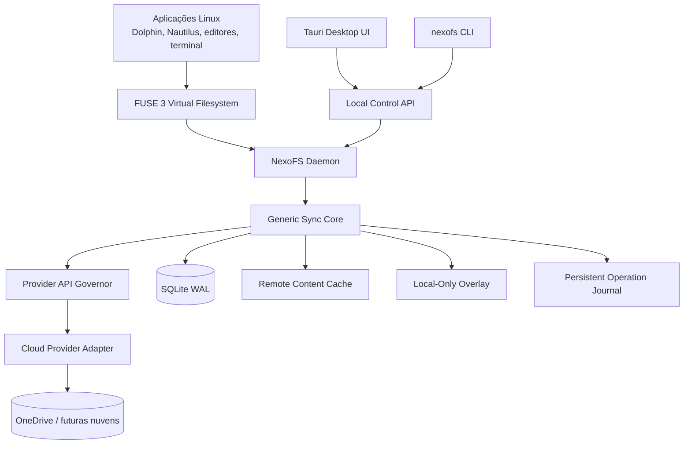
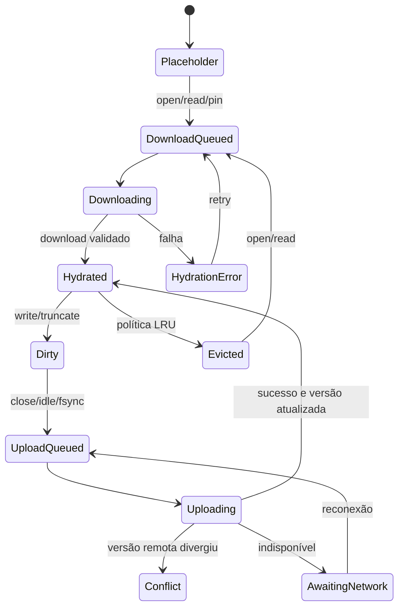
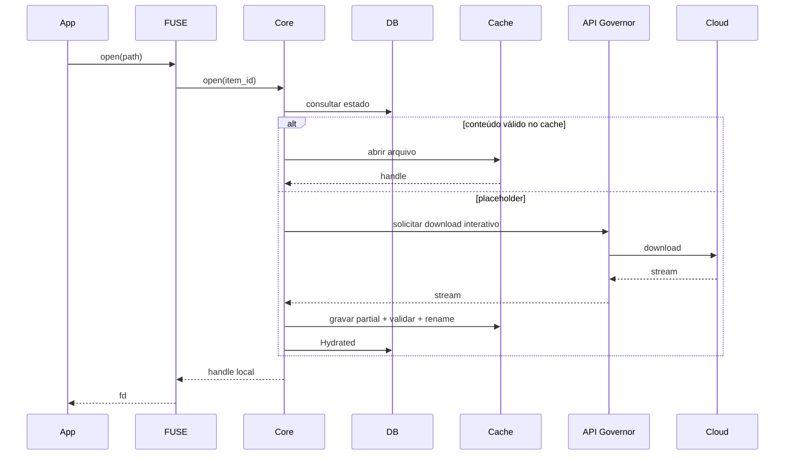

# NexoFS

## Software Engineering Specification — SPEC

**Filesystem virtual multi-cloud para Linux**  
**Versão:** 1.0  
**Data:** 23 de julho de 2026  
**Status:** Especificação técnica inicial para implementação  
**Documento de origem:** `NexoFS_PRD_v1.0.md`

> Esta especificação transforma os requisitos do PRD em contratos técnicos, componentes, modelos de dados, estados, algoritmos, interfaces e critérios verificáveis. Os termos **DEVE**, **NÃO DEVE**, **DEVERIA** e **PODE** possuem sentido normativo.

---

# 1. Controle do documento

| Campo | Valor |
|---|---|
| Produto | NexoFS |
| Documento | Software Engineering Specification — SPEC |
| Versão | 1.0 |
| Provedor inicial | Microsoft OneDrive pessoal e corporativo |
| Provedores planejados | Google Drive, Dropbox e outros adaptadores |
| Sistemas iniciais | Fedora, Ubuntu e KDE Neon |
| Desktops iniciais | GNOME e KDE Plasma |
| Sessões | Wayland e X11 |
| Linguagem principal | Rust |
| Filesystem | FUSE 3 |
| Banco local | SQLite em modo WAL |
| Interface | Tauri 2 + TypeScript |
| Serviço | `systemd --user` |

## 1.1 Objetivo

Definir uma base implementável para o NexoFS, incluindo:

- arquitetura de processos e módulos;
- fronteiras entre núcleo e adaptadores de nuvem;
- semântica do filesystem virtual;
- índice local, cache e Local-Only Overlay;
- máquina de estados de itens e operações;
- governança de APIs e prevenção de throttling;
- sincronização incremental e hidratação sob demanda;
- regras de exclusão;
- tratamento de conflitos;
- APIs locais entre daemon, CLI e interface;
- persistência, segurança, observabilidade e recuperação;
- estratégia de testes e critérios de conclusão.

## 1.2 Fora do escopo desta versão

- desenho visual detalhado de cada tela;
- especificação integral das APIs de Google Drive e Dropbox;
- integração completa com SharePoint arbitrário;
- protocolo de sincronização entre dispositivos NexoFS;
- merge automático de documentos binários;
- distribuição para Windows ou macOS.

## 1.3 Convenções de identificação

| Prefixo | Tipo |
|---|---|
| `SYS` | Requisito sistêmico |
| `FS` | Requisito do filesystem |
| `SYNC` | Sincronização |
| `API` | Governança de API |
| `CACHE` | Cache e hidratação |
| `OVL` | Local-Only Overlay |
| `IGN` | Exclusões |
| `CON` | Conflitos |
| `SEC` | Segurança |
| `OBS` | Observabilidade |
| `UI` | Interface e API local |
| `PERF` | Desempenho |
| `TEST` | Testes |

---

# 2. Visão arquitetural

## 2.1 Estilo arquitetural

O NexoFS DEVE ser implementado como uma aplicação local-first, orientada a eventos, com separação entre:

1. filesystem FUSE;
2. motor genérico de sincronização;
3. banco de metadados e journal;
4. cache de conteúdo remoto;
5. Local-Only Overlay;
6. governança de chamadas externas;
7. adaptadores de provedores;
8. API local;
9. interface gráfica e CLI.



## 2.2 Processos

### 2.2.1 `nexofsd`

Processo persistente do usuário. DEVE:

- montar e desmontar namespaces;
- responder às operações FUSE;
- manter o SQLite aberto;
- executar filas de sincronização;
- gerenciar contas e tokens via keyring;
- controlar cache e overlay;
- executar adaptadores de provedores;
- expor API local autenticada por identidade do usuário;
- continuar funcionando com a interface fechada.

### 2.2.2 `nexofs-desktop`

Interface Tauri. DEVE:

- consultar o daemon por API local;
- nunca acessar diretamente o banco;
- nunca armazenar refresh tokens;
- exibir contas, filas, conflitos, cache, erros e ações manuais.

### 2.2.3 `nexofs`

CLI administrativa. DEVE usar a mesma API local da interface.

### 2.2.4 Unidade systemd

Nome recomendado:

```text
nexofsd.service
```

Propriedades mínimas:

```ini
[Unit]
Description=NexoFS user daemon
After=network-online.target
Wants=network-online.target

[Service]
Type=notify
ExecStart=/usr/bin/nexofsd
Restart=on-failure
RestartSec=5
NoNewPrivileges=true
PrivateTmp=true

[Install]
WantedBy=default.target
```

A unidade final DEVE ser validada contra requisitos reais de FUSE, keyring e diretórios XDG antes da aplicação de hardening adicional.

---

# 3. Organização do código-fonte

## 3.1 Workspace Rust

```text
nexofs/
├── Cargo.toml
├── crates/
│   ├── nexofs-domain/
│   ├── nexofs-sync-core/
│   ├── nexofs-provider-api/
│   ├── nexofs-provider-onedrive/
│   ├── nexofs-api-governor/
│   ├── nexofs-metadata-store/
│   ├── nexofs-content-cache/
│   ├── nexofs-overlay/
│   ├── nexofs-ignore/
│   ├── nexofs-conflicts/
│   ├── nexofs-fuse/
│   ├── nexofs-auth/
│   ├── nexofs-local-api/
│   ├── nexofsd/
│   └── nexofs-cli/
├── desktop/
│   ├── src-tauri/
│   └── src/
├── migrations/
├── packaging/
│   ├── rpm/
│   ├── deb/
│   └── systemd/
├── tests/
│   ├── integration/
│   ├── fault-injection/
│   ├── scale/
│   └── fixtures/
└── docs/
```

## 3.2 Regras de dependência

- `nexofs-domain` NÃO DEVE depender de FUSE, SQLite, HTTP, Tauri ou Microsoft Graph.
- `nexofs-sync-core` DEVE depender apenas de contratos abstratos.
- Adaptadores de provedores DEVEM implementar `nexofs-provider-api`.
- `nexofs-fuse` NÃO DEVE chamar diretamente adaptadores externos.
- UI e CLI NÃO DEVEM acessar SQLite diretamente.
- Todos os requests externos DEVEM passar pelo `nexofs-api-governor`.

---

# 4. Modelo de domínio

## 4.1 Identificadores

Todos os identificadores internos DEVEM ser tipos fortes.

```rust
pub struct ProviderId(pub String);
pub struct AccountId(pub uuid::Uuid);
pub struct NamespaceId(pub uuid::Uuid);
pub struct ItemId(pub uuid::Uuid);
pub struct RemoteItemId(pub String);
pub struct OperationId(pub uuid::Uuid);
pub struct ConflictId(pub uuid::Uuid);
pub struct Inode(pub u64);
```

## 4.2 Entidades principais

### Provider

Representa uma implementação de serviço de nuvem.

```rust
pub struct ProviderDescriptor {
    pub id: ProviderId,
    pub display_name: String,
    pub capabilities: ProviderCapabilities,
}
```

### Account

Representa uma identidade autenticada em um provedor.

### Namespace

Representa um espaço remoto montável, como um OneDrive pessoal ou drive corporativo.

### Item

Representa arquivo, pasta ou item especial remoto/local.

### LocalState

Representa o estado do conteúdo local, hidratação, fixação, dirty state e versionamento base.

### Operation

Representa uma mutação durável pendente, em andamento, concluída ou falha.

### Conflict

Representa divergência que exige resolução explícita.

### ActiveDirectorySession

Representa atividade recente em um diretório observada pelo FUSE.

---

# 5. Contrato de provedor multi-cloud

## 5.1 Interface principal

```rust
#[async_trait::async_trait]
pub trait CloudProvider: Send + Sync {
    fn descriptor(&self) -> ProviderDescriptor;

    async fn authenticate(
        &self,
        request: AuthenticationRequest,
    ) -> ProviderResult<AuthenticatedAccount>;

    async fn refresh_authentication(
        &self,
        account: &ProviderAccountContext,
    ) -> ProviderResult<AuthenticationState>;

    async fn list_namespaces(
        &self,
        account: &ProviderAccountContext,
    ) -> ProviderResult<Vec<RemoteNamespace>>;

    async fn list_children(
        &self,
        request: ListChildrenRequest,
    ) -> ProviderResult<RemotePage<RemoteItem>>;

    async fn get_item(
        &self,
        request: GetItemRequest,
    ) -> ProviderResult<Option<RemoteItem>>;

    async fn create_change_cursor(
        &self,
        request: CreateCursorRequest,
    ) -> ProviderResult<ChangeCursor>;

    async fn list_changes(
        &self,
        request: ListChangesRequest,
    ) -> ProviderResult<ChangePage>;

    async fn open_download(
        &self,
        request: DownloadRequest,
    ) -> ProviderResult<DownloadHandle>;

    async fn upload(
        &self,
        request: UploadRequest,
    ) -> ProviderResult<UploadResult>;

    async fn create_directory(
        &self,
        request: CreateDirectoryRequest,
    ) -> ProviderResult<RemoteItem>;

    async fn move_item(
        &self,
        request: MoveItemRequest,
    ) -> ProviderResult<RemoteItem>;

    async fn delete_item(
        &self,
        request: DeleteItemRequest,
    ) -> ProviderResult<()>;

    async fn restore_item(
        &self,
        request: RestoreItemRequest,
    ) -> ProviderResult<RemoteItem>;
}
```

## 5.2 Capacidades

```rust
pub struct ProviderCapabilities {
    pub incremental_changes: bool,
    pub latest_cursor_without_full_scan: bool,
    pub push_notifications: bool,
    pub metadata_batch: bool,
    pub resumable_upload: bool,
    pub ranged_download: bool,
    pub stable_item_ids: bool,
    pub content_version: bool,
    pub metadata_version: bool,
    pub remote_hashes: Vec<HashAlgorithm>,
    pub atomic_move: bool,
    pub server_side_copy: bool,
    pub trash: bool,
    pub case_sensitivity: CaseSensitivity,
    pub max_simple_upload_bytes: Option<u64>,
    pub max_item_name_bytes: Option<u32>,
    pub max_path_bytes: Option<u32>,
}
```

## 5.3 Erros normalizados

```rust
pub enum ProviderErrorKind {
    AuthenticationRequired,
    AuthorizationDenied,
    NotFound,
    AlreadyExists,
    VersionConflict,
    RateLimited { retry_after: Option<Duration> },
    TemporarilyUnavailable { retry_after: Option<Duration> },
    QuotaExceeded,
    InvalidName,
    UnsupportedOperation,
    Network,
    Timeout,
    CorruptResponse,
    Permanent,
}
```

O adaptador DEVE converter respostas específicas para essa taxonomia.

---

# 6. Adaptador Microsoft OneDrive

## 6.1 Responsabilidades

O adaptador DEVE implementar:

- OAuth 2.0 Authorization Code com PKCE;
- contas Microsoft pessoais e corporativas;
- descoberta dos drives/namespaces autorizados;
- listagem de filhos;
- delta cursor e processamento incremental;
- download integral e, posteriormente, por range;
- upload simples e resumível;
- criação de diretório;
- rename/move/delete;
- versionamento otimista por ETag/CTag;
- normalização de erros e throttling.

## 6.2 Regras específicas

- `remote_item_id` DEVE usar o identificador estável retornado pelo Graph.
- `remote_version` DEVE representar a versão de item/metadados.
- `remote_content_version` DEVE representar a versão do conteúdo quando disponível.
- URLs temporárias de download NÃO DEVEM ser persistidas além do necessário.
- `$batch` PODE ser usado apenas para operações compatíveis de metadados.
- `$batch` NÃO DEVE ser tratado como redução do custo lógico de cada suboperação.
- Upload de múltiplos arquivos independentes NÃO DEVE ser modelado como operação atômica única.

---

# 7. Provider API Governor

## 7.1 Requisito central

**API-001:** Nenhum adaptador DEVE executar uma chamada externa sem autorização do `ProviderApiGovernor`.

## 7.2 Chave de limitação

```rust
pub struct RateScope {
    pub provider_id: ProviderId,
    pub account_id: AccountId,
    pub organization_scope: Option<String>,
    pub namespace_id: Option<NamespaceId>,
    pub operation_class: OperationClass,
}
```

## 7.3 Classes de operação

```rust
pub enum OperationClass {
    InteractiveMetadata,
    InteractiveDownload,
    ChangeTracking,
    Upload,
    RemoteMutation,
    BackgroundIndex,
    Maintenance,
}
```

## 7.4 Algoritmos obrigatórios

O governador DEVE combinar:

- semaphore por escopo;
- token bucket para rajadas;
- fila de prioridade;
- deduplicação de operações equivalentes;
- circuit breaker;
- exponential backoff com jitter;
- suporte a `Retry-After`;
- ajuste adaptativo de concorrência.

## 7.5 Prioridades

| Prioridade | Classe |
|---:|---|
| 0 | Validação para impedir perda de dados |
| 10 | Download interativo |
| 20 | Upload de alterações locais persistidas |
| 30 | Operação manual “Verificar atualizações” |
| 40 | Atualização por diretório ativo |
| 50 | Mutações remotas ordinárias |
| 60 | Download de conteúdo fixado |
| 80 | Indexação em background |
| 90 | Manutenção |

Menor valor representa maior prioridade.

## 7.6 Deduplicação

Chave recomendada:

```text
provider_id + account_id + namespace_id + operation_kind + semantic_target
```

Exemplos:

- múltiplos eventos de navegação no mesmo namespace compartilham uma consulta delta;
- cliques repetidos em atualização manual compartilham a mesma execução;
- duas solicitações simultâneas de hidratação do mesmo arquivo compartilham o download.

## 7.7 Circuit breaker

```rust
pub enum CircuitState {
    Closed,
    Open { until: Instant },
    HalfOpen,
}
```

Regras:

1. `429` com `Retry-After`: abrir até o prazo indicado.
2. `429` sem prazo: calcular backoff exponencial.
3. `503` e timeout recorrente: abrir circuito após limiar configurado.
4. Em `Open`, operações não críticas permanecem enfileiradas.
5. Em `HalfOpen`, liberar apenas uma quantidade limitada de probes.
6. Sucesso consistente fecha o circuito gradualmente.

## 7.8 Valores iniciais

| Operação | Limite inicial por conta |
|---|---:|
| Delta por namespace | 1 |
| Downloads interativos | 4 |
| Uploads | 2 |
| Mutações de metadados | 2 |
| Indexação de background | 1 |

Os valores DEVEM ser configuráveis e adaptativos.

## 7.9 Controle de tempestade de arquivos

**API-020:** Ao detectar mais de 1.000 novos itens em 30 segundos numa mesma subárvore, o NexoFS DEVE pausar a criação de operações remotas para essa subárvore e executar classificação de risco.

A classificação DEVE verificar:

- regra de exclusão aplicável;
- perfil de projeto detectável;
- taxa de criação;
- nomes típicos de dependências/cache;
- número estimado de chamadas;
- espaço local e remoto;
- estado atual de throttling.

---

# 8. Filesystem FUSE

## 8.1 Pontos de montagem

Padrão recomendado:

```text
$HOME/NexoFS/<nome-da-conta>
```

O usuário PODE configurar outro diretório que:

- pertença ao usuário;
- não seja raiz de outro mount;
- não esteja dentro do cache/overlay do próprio NexoFS;
- não forme recursão com outro namespace NexoFS.

## 8.2 Operações suportadas no MVP

| Operação | MVP | Semântica |
|---|---:|---|
| `lookup` | Sim | Índice local, com lazy fetch quando necessário |
| `getattr` | Sim | Índice local |
| `opendir` | Sim | Marca diretório ativo |
| `readdir` | Sim | Índice local; carrega filhos se desconhecidos |
| `open` | Sim | Hidrata se necessário |
| `read` | Sim | Cache local |
| `create` | Sim | Cria item local dirty |
| `write` | Sim | Copy-on-write local |
| `flush` | Sim | Persiste estado local |
| `fsync` | Sim | Durabilidade local, não garantia de nuvem |
| `release` | Sim | Agenda upload estabilizado |
| `mkdir` | Sim | Operação local durável |
| `rename` | Sim | Atualização local atômica + journal |
| `unlink` | Sim | Tombstone local + journal |
| `rmdir` | Sim | Validação de filhos e journal |
| `setattr/truncate` | Sim | Copy-on-write |
| symlink | Não | `ENOTSUP` no MVP |
| hard link | Não | `ENOTSUP` |
| device/FIFO/socket | Não | `ENOTSUP` |

## 8.3 Inodes

O inode DEVE permanecer estável entre renames e moves.

```text
inode = stable_hash(provider_id, account_id, namespace_id, remote_item_id/local_item_uuid)
```

Requisitos:

- hash com baixa probabilidade de colisão;
- mapa persistente para colisões detectadas;
- itens locais sem `remote_item_id` usam UUID local;
- inode NÃO DEVE derivar do caminho completo.

## 8.4 Semântica de `fsync`

`fsync` DEVE garantir:

- conteúdo gravado no armazenamento local;
- metadata e operação persistidas no SQLite/journal;
- arquivo recuperável após reinício.

`fsync` NÃO DEVE significar que o upload remoto terminou. Uma extensão futura PODE oferecer operação explícita “aguardar sincronização remota”.

## 8.5 Atributos POSIX

Modo inicial:

- arquivo remoto gravável: `0644`;
- arquivo remoto somente leitura: `0444`;
- diretório gravável: `0755`;
- diretório somente leitura: `0555`.

UID e GID DEVEM corresponder ao usuário do daemon.

## 8.6 Cache de atributos

TTL inicial:

| Tipo | TTL |
|---|---:|
| `getattr` de item estável | 5 s |
| entrada de diretório | 3 s |
| cache negativo | 2 s |
| item dirty/conflito | 0–1 s |

O daemon DEVE invalidar seletivamente entradas alteradas por delta ou operação local.

---

# 9. Detecção de navegação ativa

## 9.1 Modelo

O NexoFS NÃO DEVE depender da identificação do processo Dolphin ou Nautilus. A atividade será inferida por operações FUSE.

Eventos relevantes:

- `opendir`;
- `readdir`;
- `lookup` recorrente;
- `getattr` em lote;
- `open` de item no diretório.

## 9.2 Estado

```rust
pub struct ActiveDirectorySession {
    pub namespace_id: NamespaceId,
    pub item_id: ItemId,
    pub opened_at: Instant,
    pub last_activity_at: Instant,
    pub expires_at: Instant,
    pub activity_score: u32,
}
```

## 9.3 Algoritmo

1. Na primeira operação relevante, marcar a pasta ativa por 60 segundos.
2. Atualizar `last_activity_at` a cada evento.
3. Aplicar debounce de 2 segundos.
4. Agendar no máximo uma verificação incremental por namespace.
5. Respeitar intervalo mínimo de 30 segundos desde a última verificação bem-sucedida.
6. Se já houver delta em voo, associar a solicitação ao mesmo future.
7. Expirar a sessão após inatividade.

## 9.4 Requisitos

- **SYNC-010:** Dez diretórios abertos no mesmo namespace NÃO DEVEM gerar dez chamadas delta.
- **SYNC-011:** Sem diretórios ativos, NÃO DEVE haver polling frequente de descoberta remota.
- **SYNC-012:** Uploads locais e recuperação de operações DEVEM continuar mesmo sem diretório ativo.
- **SYNC-013:** Abertura de pasta ainda não indexada PODE exigir `list_children`, além do delta consolidado.

---

# 10. Índice local e SQLite

## 10.1 Localização

Seguindo XDG:

```text
$XDG_DATA_HOME/nexofs/metadata/nexofs.sqlite3
```

Fallback:

```text
$HOME/.local/share/nexofs/metadata/nexofs.sqlite3
```

## 10.2 Configuração

```sql
PRAGMA journal_mode = WAL;
PRAGMA synchronous = NORMAL;
PRAGMA foreign_keys = ON;
PRAGMA busy_timeout = 5000;
PRAGMA temp_store = MEMORY;
PRAGMA wal_autocheckpoint = 2000;
```

## 10.3 Esquema inicial

```sql
CREATE TABLE providers (
    provider_id          TEXT PRIMARY KEY,
    display_name         TEXT NOT NULL,
    capabilities_json    TEXT NOT NULL,
    created_at           INTEGER NOT NULL,
    updated_at           INTEGER NOT NULL
);

CREATE TABLE accounts (
    account_id           TEXT PRIMARY KEY,
    provider_id          TEXT NOT NULL REFERENCES providers(provider_id),
    provider_account_id  TEXT NOT NULL,
    account_type         TEXT NOT NULL,
    display_name         TEXT NOT NULL,
    tenant_id            TEXT,
    auth_state           TEXT NOT NULL,
    enabled              INTEGER NOT NULL DEFAULT 1,
    created_at           INTEGER NOT NULL,
    updated_at           INTEGER NOT NULL,
    UNIQUE(provider_id, provider_account_id)
);

CREATE TABLE namespaces (
    namespace_id         TEXT PRIMARY KEY,
    account_id           TEXT NOT NULL REFERENCES accounts(account_id),
    remote_namespace_id  TEXT NOT NULL,
    display_name         TEXT NOT NULL,
    namespace_type       TEXT NOT NULL,
    mount_path           TEXT NOT NULL UNIQUE,
    mount_state          TEXT NOT NULL,
    change_cursor        TEXT,
    cursor_state         TEXT NOT NULL DEFAULT 'UNINITIALIZED',
    last_change_check_at INTEGER,
    last_full_scan_at    INTEGER,
    created_at           INTEGER NOT NULL,
    updated_at           INTEGER NOT NULL,
    UNIQUE(account_id, remote_namespace_id)
);

CREATE TABLE items (
    item_id               TEXT PRIMARY KEY,
    namespace_id          TEXT NOT NULL REFERENCES namespaces(namespace_id),
    remote_item_id        TEXT,
    parent_item_id        TEXT REFERENCES items(item_id),
    name                   TEXT NOT NULL,
    normalized_name       TEXT NOT NULL,
    item_type              TEXT NOT NULL,
    size_bytes             INTEGER NOT NULL DEFAULT 0,
    mime_type              TEXT,
    remote_version         TEXT,
    remote_content_version TEXT,
    remote_modified_at     INTEGER,
    remote_created_at      INTEGER,
    children_state         TEXT NOT NULL DEFAULT 'UNKNOWN',
    remote_state           TEXT NOT NULL DEFAULT 'PRESENT',
    source_layer           TEXT NOT NULL DEFAULT 'REMOTE',
    provider_metadata_json TEXT,
    created_at             INTEGER NOT NULL,
    updated_at             INTEGER NOT NULL,
    UNIQUE(namespace_id, remote_item_id)
);

CREATE UNIQUE INDEX idx_items_parent_name
ON items(namespace_id, parent_item_id, normalized_name)
WHERE remote_state <> 'DELETED';

CREATE INDEX idx_items_parent
ON items(namespace_id, parent_item_id);

CREATE TABLE local_states (
    item_id                TEXT PRIMARY KEY REFERENCES items(item_id),
    hydration_state        TEXT NOT NULL,
    pin_state              TEXT NOT NULL,
    sync_state             TEXT NOT NULL,
    local_version          INTEGER NOT NULL DEFAULT 0,
    base_remote_version    TEXT,
    base_content_version   TEXT,
    cache_object_id        TEXT,
    overlay_path           TEXT,
    local_size_bytes       INTEGER,
    local_modified_at      INTEGER,
    last_access_at         INTEGER,
    open_handle_count      INTEGER NOT NULL DEFAULT 0,
    dirty_since            INTEGER,
    error_code             TEXT,
    error_message          TEXT,
    updated_at             INTEGER NOT NULL
);

CREATE TABLE operations (
    operation_id           TEXT PRIMARY KEY,
    namespace_id           TEXT NOT NULL REFERENCES namespaces(namespace_id),
    item_id                 TEXT REFERENCES items(item_id),
    operation_type         TEXT NOT NULL,
    state                  TEXT NOT NULL,
    priority               INTEGER NOT NULL,
    idempotency_key        TEXT NOT NULL,
    attempt_count          INTEGER NOT NULL DEFAULT 0,
    next_attempt_at        INTEGER,
    base_remote_version    TEXT,
    payload_json           TEXT NOT NULL,
    last_error_kind        TEXT,
    last_error_message     TEXT,
    created_at             INTEGER NOT NULL,
    updated_at             INTEGER NOT NULL,
    UNIQUE(idempotency_key)
);

CREATE INDEX idx_operations_scheduler
ON operations(state, next_attempt_at, priority, created_at);

CREATE TABLE conflicts (
    conflict_id            TEXT PRIMARY KEY,
    namespace_id           TEXT NOT NULL REFERENCES namespaces(namespace_id),
    item_id                 TEXT REFERENCES items(item_id),
    conflict_type          TEXT NOT NULL,
    state                  TEXT NOT NULL,
    local_version          INTEGER,
    base_remote_version    TEXT,
    current_remote_version TEXT,
    local_snapshot_path    TEXT,
    remote_snapshot_path   TEXT,
    resolution             TEXT,
    resolution_payload_json TEXT,
    detected_at            INTEGER NOT NULL,
    resolved_at            INTEGER
);

CREATE TABLE ignore_rules (
    rule_id                TEXT PRIMARY KEY,
    namespace_id           TEXT REFERENCES namespaces(namespace_id),
    root_item_id            TEXT REFERENCES items(item_id),
    source_type             TEXT NOT NULL,
    pattern                 TEXT NOT NULL,
    negated                 INTEGER NOT NULL DEFAULT 0,
    directory_only          INTEGER NOT NULL DEFAULT 0,
    enabled                 INTEGER NOT NULL DEFAULT 1,
    precedence              INTEGER NOT NULL,
    created_at              INTEGER NOT NULL,
    updated_at              INTEGER NOT NULL
);

CREATE TABLE cache_objects (
    cache_object_id         TEXT PRIMARY KEY,
    storage_path            TEXT NOT NULL UNIQUE,
    size_bytes              INTEGER NOT NULL,
    content_hash            TEXT,
    state                   TEXT NOT NULL,
    created_at              INTEGER NOT NULL,
    last_access_at          INTEGER NOT NULL,
    ref_count               INTEGER NOT NULL DEFAULT 1
);

CREATE TABLE inode_map (
    namespace_id           TEXT NOT NULL REFERENCES namespaces(namespace_id),
    item_id                 TEXT NOT NULL REFERENCES items(item_id),
    inode                   INTEGER NOT NULL,
    PRIMARY KEY(namespace_id, item_id),
    UNIQUE(namespace_id, inode)
);
```

## 10.4 Escritor único

O `metadata-store` DEVE serializar escritas por meio de um writer task. Leituras PODEM usar pool dedicado.

## 10.5 Migrations

- Toda versão binária DEVE declarar versão mínima e máxima do schema.
- Migration DEVE ser transacional quando SQLite permitir.
- Antes de migration destrutiva, criar backup consistente.
- Downgrade de schema NÃO É obrigatório no MVP.

---

# 11. Camadas de armazenamento local

## 11.1 Estrutura XDG

```text
$XDG_DATA_HOME/nexofs/
├── metadata/
│   └── nexofs.sqlite3
├── cache/
│   ├── clean/
│   ├── dirty/
│   ├── partial/
│   └── conflict/
├── overlay/
│   └── <namespace-id>/
├── journal/
└── diagnostics/
```

## 11.2 Remote Content Cache

Conteúdo remoto hidratado e potencialmente removível.

Requisitos:

- arquivos limpos podem ser evictados;
- arquivos dirty, pinned, abertos ou em conflito não podem;
- gravação usa arquivo temporário + `fsync` + rename atômico;
- cache incompleto nunca é apresentado como íntegro.

## 11.3 Dirty Content Store

Ao modificar arquivo remoto, o NexoFS DEVE criar versão gravável local sem alterar diretamente um objeto clean compartilhado.

## 11.4 Local-Only Overlay

Conteúdo excluído da sincronização DEVE ficar persistente no overlay.

- NÃO é cache;
- NÃO é evictado por LRU;
- aparece na árvore FUSE;
- participa do cálculo de uso local;
- nunca gera operação remota enquanto regra `LOCAL_ONLY` estiver ativa.

## 11.5 Resolução de camada

Ordem lógica para lookup:

1. tombstones locais;
2. Local-Only Overlay;
3. itens locais dirty ainda não remotos;
4. árvore remota indexada;
5. lazy fetch remoto, se autorizado.

---

# 12. Máquina de estados de item

## 12.1 Hidratação

```rust
pub enum HydrationState {
    Placeholder,
    DownloadQueued,
    Downloading,
    Hydrated,
    Partial,
    Evicted,
    HydrationError,
}
```

## 12.2 Fixação

```rust
pub enum PinState {
    OnlineOnly,
    AvailableLocally,
    Pinned,
}
```

## 12.3 Sincronização

```rust
pub enum SyncState {
    Clean,
    Dirty,
    UploadQueued,
    Uploading,
    AwaitingNetwork,
    AwaitingAuthentication,
    Conflict,
    Error,
    DeletedLocally,
}
```

## 12.4 Transições principais



## 12.5 Invariantes

- Item `Dirty` DEVE possuir conteúdo local durável.
- Item `Conflict` DEVE possuir snapshot local preservado.
- Item `Pinned` NÃO PODE ser evictado.
- Item com `open_handle_count > 0` NÃO PODE ser evictado.
- Item `Clean` NÃO PODE apontar para conteúdo local diferente da versão remota registrada.

---

# 13. Journal e operações

## 13.1 Estados de operação

```rust
pub enum OperationState {
    Pending,
    Running,
    WaitingRetry,
    WaitingNetwork,
    WaitingAuthentication,
    BlockedByConflict,
    Completed,
    Cancelled,
    FailedPermanent,
}
```

## 13.2 Tipos

```rust
pub enum OperationType {
    UploadFile,
    CreateDirectory,
    MoveItem,
    RenameItem,
    DeleteItem,
    RestoreItem,
    HydrateItem,
    PinTree,
    RefreshChanges,
    ReconcileNamespace,
}
```

## 13.3 Idempotência

Cada operação remota DEVE possuir `idempotency_key` estável.

Exemplos:

```text
upload:<namespace>:<item>:<local_version>
move:<namespace>:<item>:<target_parent>:<target_name>:<local_version>
delete:<namespace>:<item>:<local_version>
```

## 13.4 Coalescência

Antes da execução, o journal DEVE simplificar:

- várias escritas → um upload final;
- create + delete antes do upload → cancelar ambos;
- múltiplos renames → nome final;
- move + rename → operação combinada quando suportada;
- upload obsoleto por nova versão local → cancelar versão anterior.

## 13.5 Recuperação

Ao iniciar:

1. operações `Running` passam para `Pending` ou estado recuperável;
2. downloads parciais são validados;
3. sessões de upload válidas são retomadas;
4. locks lógicos expirados são removidos;
5. invariantes do banco são verificadas;
6. montagem só é disponibilizada após estado mínimo consistente.

---

# 14. Sincronização incremental

## 14.1 Cursor

Cada namespace DEVE possuir cursor opaco persistido exatamente como retornado pelo provedor.

Estados:

```rust
pub enum CursorState {
    Uninitialized,
    Valid,
    Refreshing,
    Expired,
    Rebuilding,
    Error,
}
```

## 14.2 Processamento de página

Cada página de mudanças DEVE ser aplicada em transação:

1. parse e validação;
2. upsert por `remote_item_id`;
3. atualização de pai/nome/versões;
4. criação de tombstones para removidos;
5. detecção de conflito com dirty local;
6. registro dos diretórios/inodes afetados;
7. persistência do próximo cursor somente após aplicar toda a página;
8. commit;
9. invalidação FUSE após commit.

## 14.3 Cursor expirado

O NexoFS DEVE:

- preservar a árvore atual;
- marcar namespace como `Rebuilding`;
- obter novo cursor ou realizar reconciliação progressiva;
- não apagar o índice antes da confirmação;
- reconciliar por ID remoto;
- sinalizar inconsistências sem indisponibilizar todo o mount.

## 14.4 Atualização manual

Endpoint local:

```text
POST /v1/namespaces/{id}/refresh
```

Semântica:

- prioridade alta;
- idempotente enquanto já estiver em voo;
- respeita Governor;
- retorna `operation_id` compartilhado;
- não força full scan salvo parâmetro administrativo explícito.

---

# 15. Hidratação e leitura

## 15.1 Fluxo de abertura



## 15.2 Integridade

Validar, quando disponíveis:

- tamanho esperado;
- hash remoto;
- versão remota antes/depois;
- status HTTP e comprimento.

## 15.3 Downloads compartilhados

Solicitações concorrentes do mesmo item/versão DEVEM compartilhar um único download.

## 15.4 Download por range

Não obrigatório no primeiro MVP. A abstração DEVE permitir futura implementação por intervalos e sparse files.

---

# 16. Escrita e upload

## 16.1 Copy-on-write

Na primeira escrita sobre item clean:

1. criar cópia local dirty ou reflink quando suportado;
2. registrar `base_remote_version`;
3. incrementar `local_version`;
4. tornar o conteúdo durável;
5. responder à aplicação sem aguardar rede.

## 16.2 Estabilização

Upload será agendado quando ocorrer primeiro evento válido:

- `release` do último handle gravável;
- `fsync`, conforme política;
- 5 segundos sem nova escrita;
- comando manual.

Nova escrita antes do upload concluir cria uma nova versão local e torna upload anterior obsoleto.

## 16.3 Controle otimista

Antes/ao enviar, o adaptador DEVE condicionar a operação à versão base quando suportado.

Resultado:

- versão igual → upload;
- versão diferente → conflito;
- item removido remotamente → conflito de exclusão;
- auth/network/rate limit → retry sem perda local.

## 16.4 Upload resumível

O estado da sessão DEVE ser persistido em `payload_json`, incluindo:

- URL/token opaco da sessão;
- expiração;
- ranges confirmados;
- tamanho local;
- versão local;
- versão remota base.

Dados sensíveis da sessão DEVEM ser redigidos nos logs.

---

# 17. Exclusões e `.nexofsignore`

## 17.1 Sintaxe

Compatível conceitualmente com `.gitignore`:

- `#` comentário;
- `!` negação;
- `/` relativo à raiz da regra;
- `**` recursivo;
- `/` final indica diretório;
- glob para nome/extensão.

## 17.2 Precedência

Da menor para maior prioridade:

1. defaults internos;
2. política administrativa;
3. perfil de tecnologia;
4. regra global do usuário;
5. regra da conta;
6. regra da pasta;
7. `.nexofsignore` mais próximo;
8. exceção explícita do usuário.

A última regra aplicável vence.

## 17.3 Resultado

```rust
pub enum SyncDisposition {
    NormalSync,
    LocalOnly,
    RemotePlaceholder,
    IgnoreChanges,
}
```

## 17.4 Perfis iniciais

- Node.js: `node_modules/`, `.next/cache/`, `.npm/`, `.yarn/cache/`, `.pnpm-store/`.
- PHP/Laravel: `vendor/`, `storage/framework/cache/`, `storage/framework/sessions/`, `storage/framework/views/`, `bootstrap/cache/`.
- Python: `.venv/`, `venv/`, `__pycache__/`, `.pytest_cache/`, `.mypy_cache/`.
- Java/Gradle: `target/`, `.gradle/`, `build/`.
- Rust: `target/`.
- .NET: `bin/`, `obj/`.

Perfis sugeridos NÃO DEVEM ser ativados silenciosamente sem política pré-configurada.

## 17.5 Mudança de regra

### Sincronizado → LocalOnly

Exigir decisão:

- manter remoto e criar versão local independente;
- remover remoto e manter local;
- cancelar.

### LocalOnly → NormalSync

Antes de executar:

- contar itens e bytes;
- estimar operações;
- classificar risco;
- pedir confirmação quando acima do limiar;
- usar fila de baixa prioridade.

---

# 18. Conflitos

## 18.1 Tipos

```rust
pub enum ConflictType {
    ContentChangedBothSides,
    RemoteDeletedLocalModified,
    LocalDeletedRemoteModified,
    RenameCollision,
    MoveCollision,
    CaseCollision,
    LocalOnlyRemoteCollision,
    ParentDeleted,
    UnsupportedName,
}
```

## 18.2 Detecção

Conflito DEVE ser criado quando:

```text
local_dirty == true
AND current_remote_version != base_remote_version
```

ou quando uma operação não pode ser mapeada sem descartar dados.

## 18.3 Preservação

- snapshot local imutável;
- metadados da versão remota;
- download remoto opcional para comparação;
- bloqueio de eviction;
- suspensão de operação destrutiva relacionada.

## 18.4 Resoluções

```rust
pub enum ConflictResolution {
    KeepLocal,
    KeepRemote,
    KeepBoth,
    SaveLocalElsewhere,
    DismissTemporarily,
}
```

### KeepBoth

Nome padrão:

```text
<base> (conflito local YYYY-MM-DD HH-mm[-n]).<ext>
```

O algoritmo DEVE preservar extensão, validar limites e evitar colisão.

---

# 19. Cache e eviction

## 19.1 Quota

Configurações:

- limite máximo em bytes;
- espaço mínimo livre do filesystem host;
- idade máxima sem acesso;
- política por namespace;
- quota global.

## 19.2 Elegibilidade

```text
pinned == false
AND dirty == false
AND conflict == false
AND open_handle_count == 0
AND operation_reference_count == 0
AND source_layer == REMOTE
```

## 19.3 Política

MVP: LRU por `last_access_at`, com preferência por arquivos grandes e facilmente reidratáveis em caso de pressão severa.

## 19.4 Pressão de disco

Níveis:

- normal;
- warning;
- critical;
- emergency.

Em `emergency`, o NexoFS DEVE:

1. interromper prefetch/download fixado não iniciado;
2. evictar todos os elegíveis;
3. impedir novas hidratações grandes quando não houver espaço;
4. preservar dirty/conflitos/overlay;
5. notificar o usuário.

---

# 20. API local

## 20.1 Transporte

Unix Domain Socket recomendado:

```text
$XDG_RUNTIME_DIR/nexofs/control.sock
```

Permissão `0600`. O daemon DEVE validar UID do peer quando disponível.

## 20.2 Formato

HTTP/1.1 local com JSON ou protocolo equivalente tipado. Versão no caminho: `/v1`.

## 20.3 Endpoints mínimos

```text
GET    /v1/status
GET    /v1/accounts
POST   /v1/accounts/auth/start
POST   /v1/accounts/auth/complete
DELETE /v1/accounts/{account_id}
GET    /v1/namespaces
POST   /v1/namespaces/{id}/mount
POST   /v1/namespaces/{id}/unmount
POST   /v1/namespaces/{id}/refresh
POST   /v1/namespaces/{id}/pause
POST   /v1/namespaces/{id}/resume
GET    /v1/operations
POST   /v1/operations/{id}/retry
POST   /v1/operations/{id}/cancel
GET    /v1/conflicts
POST   /v1/conflicts/{id}/resolve
GET    /v1/cache
POST   /v1/cache/cleanup
GET    /v1/ignore-rules
POST   /v1/ignore-rules
DELETE /v1/ignore-rules/{id}
GET    /v1/events
POST   /v1/diagnostics/package
```

## 20.4 Eventos

A API DEVE oferecer stream local de eventos por SSE ou WebSocket:

- account state changed;
- namespace mounted/unmounted;
- operation progress;
- transfer progress;
- conflict created/resolved;
- throttling state;
- cache pressure;
- authentication required;
- refresh completed.

## 20.5 Modelo de erro

```json
{
  "error": {
    "code": "RATE_LIMITED",
    "message": "O provedor limitou temporariamente novas operações.",
    "retry_after_seconds": 120,
    "operation_id": "...",
    "details": {}
  }
}
```

---

# 21. Interface gráfica

## 21.1 Telas mínimas

- visão geral;
- adicionar conta;
- detalhes da conta/namespace;
- transferências e operações;
- conflitos;
- cache e espaço local;
- regras de exclusão;
- configurações;
- diagnóstico.

## 21.2 Atualização manual

Botões:

- global: todas as contas;
- por conta/namespace;
- ação de bandeja.

Estados:

- disponível;
- verificando;
- consolidado com verificação existente;
- aguardando rate limit;
- autenticação necessária;
- concluído;
- falha.

## 21.3 Integração desktop

MVP NÃO depende de plugins de Dolphin/Nautilus. Integrações posteriores podem adicionar:

- emblemas;
- menus de contexto;
- “Sempre disponível”;
- “Liberar espaço”;
- status de sincronização.

---

# 22. Autenticação e segurança

## 22.1 OAuth

- Authorization Code + PKCE;
- navegador do sistema;
- loopback redirect local ou custom URI seguro;
- nenhum client secret embutido;
- permissões mínimas delegadas.

## 22.2 Tokens

- refresh tokens no Secret Service/KWallet/GNOME Keyring;
- access tokens somente em memória quando possível;
- SQLite armazena apenas referência ao segredo;
- logs nunca incluem token ou URL de upload/download temporária.

## 22.3 Permissões locais

- banco/cache/overlay acessíveis somente ao usuário;
- socket `0600`;
- diagnóstico com consentimento;
- arquivos temporários criados com modo restritivo.

## 22.4 Ameaças principais

| Ameaça | Mitigação |
|---|---|
| Roubo de token | Keyring, menor privilégio, redaction |
| Processo local não autorizado | socket restrito + peer credentials |
| Path traversal | componentes validados, APIs por item ID |
| Symlink attack em cache | `openat`, `O_NOFOLLOW`, diretórios privados |
| Corrupção de conteúdo | arquivos temporários, hash/tamanho, rename atômico |
| Sobrescrita remota | versionamento otimista e conflitos |
| Exaustão de API | Governor obrigatório |
| Exaustão de disco | quotas e pressure states |

---

# 23. Observabilidade

## 23.1 Logs estruturados

Formato JSON opcional e texto legível para journald.

Campos:

- timestamp;
- level;
- component;
- account_id anonimizado;
- namespace_id;
- operation_id;
- item_id interno;
- provider;
- event;
- duration_ms;
- retry_count;
- error_kind.

## 23.2 Métricas locais

- requests por provider/classe/status;
- 429/503 e tempo em circuit open;
- latência das APIs;
- filas por estado;
- bytes upload/download;
- cache hit ratio;
- tamanho de cache/overlay/banco;
- tempo de `lookup`, `readdir`, `open`;
- quantidade de itens indexados;
- conflitos;
- operações coalescidas/evitadas;
- delta pages e itens alterados.

## 23.3 Diagnóstico

Pacote deve incluir:

- versão;
- distro/kernel/desktop/session;
- estado systemd/FUSE;
- schema version;
- métricas resumidas;
- logs recentes redigidos;
- integridade SQLite;
- filas e circuit breakers;
- sem conteúdo de arquivos nem segredos.

---

# 24. Desempenho e escalabilidade

## 24.1 Metas

| Métrica | Meta inicial |
|---|---:|
| Montagem com índice existente | ≤ 3 s |
| `getattr` local p95 | ≤ 50 ms |
| `readdir` indexado p95 | ≤ 300 ms |
| abertura hidratada p95 | ≤ 150 ms |
| CPU ociosa | < 1% média |
| RSS normal do daemon | < 300 MB |
| itens por namespace | ≥ 1 milhão |
| filhos em uma pasta | ≥ 100 mil com paginação/streaming |

## 24.2 Restrições de memória

- não carregar árvore inteira em memória;
- páginas de delta/listagem processadas em streaming/lotes;
- caches de metadata com limites;
- strings internadas apenas se comprovadamente úteis;
- resultados de `readdir` paginados internamente.

## 24.3 Banco

- índices obrigatórios conforme consultas reais;
- evitar `SELECT *` em caminhos críticos;
- batch transaction para páginas remotas;
- manutenção incremental e checkpoint WAL controlado.

---

# 25. Compatibilidade Linux

## 25.1 Matriz obrigatória

| Distribuição | Desktop | Sessão | Gerenciador |
|---|---|---|---|
| Fedora | GNOME | Wayland | Nautilus |
| Fedora | KDE Plasma | Wayland | Dolphin |
| Ubuntu LTS | GNOME | Wayland | Nautilus |
| KDE Neon | KDE Plasma | Wayland | Dolphin |
| Fedora | GNOME | X11 | Nautilus |
| Ubuntu/KDE Neon | KDE Plasma | X11 | Dolphin |

## 25.2 Empacotamento

- RPM oficial;
- DEB oficial;
- repositórios assinados em fase posterior;
- AppImage somente para UI, não como substituto do daemon host;
- Flatpak não prioritário no MVP.

## 25.3 Dependências

- FUSE 3;
- systemd user session;
- Secret Service ou integração equivalente;
- WebView compatível com Tauri;
- bibliotecas TLS do pacote.

---

# 26. Estratégia de testes

## 26.1 Unitários

- parser e precedência de ignore;
- state machines;
- coalescência;
- nome de conflito;
- rate limiter/backoff;
- eligibility de cache;
- path normalization;
- inode allocation;
- normalização de erros.

## 26.2 Integração

- SQLite migrations/recovery;
- FUSE contra aplicações reais;
- provider fake determinístico;
- OneDrive sandbox/test tenant;
- keyring;
- systemd user;
- API local e UI.

## 26.3 Fault injection

- kill durante commit/upload/download;
- corrupção de partial;
- perda de rede;
- 401, 403, 404, 409/412, 429, 503;
- cursor expirado;
- disco cheio;
- rename concorrente;
- processo mantendo arquivo aberto;
- relógio alterado.

## 26.4 Escala

Fixtures sintéticas:

- 100 mil, 1 milhão e 5 milhões de itens;
- pasta com 100 mil filhos;
- 1 milhão de arquivos ignorados em `node_modules`;
- 10 mil mudanças delta;
- arquivo de 100 GB simulado;
- múltiplas contas;
- alta latência e baixa largura de banda.

## 26.5 Testes de API efficiency

- 10 `readdir` simultâneos → 1 delta por namespace;
- 20 gravações → 1 upload final;
- create+delete antes de upload → 0 chamadas;
- cliques repetidos refresh → 1 operação;
- `429` → nenhuma chamada antes de `Retry-After`, exceto probe controlado;
- diretório ignorado → 0 operações remotas por arquivo.

---

# 27. Critérios de conclusão técnica

## 27.1 MVP leitura

- conta OneDrive pessoal e corporativa;
- mount FUSE em GNOME/KDE;
- índice persistente;
- lazy list;
- delta consolidado;
- download sob demanda;
- cache com quota;
- refresh manual;
- Governor e throttling;
- recuperação após restart.

## 27.2 MVP escrita

- create/write/rename/move/delete;
- journal durável;
- upload simples/resumível;
- versionamento otimista;
- modo offline;
- conflitos básicos;
- coalescência.

## 27.3 Exclusões

- `.nexofsignore`;
- perfis Node/Laravel;
- Local-Only Overlay;
- alertas de tempestade;
- zero upload de diretório excluído.

## 27.4 Multi-cloud readiness

- core compilável com provider fake;
- OneDrive isolado em crate próprio;
- nenhuma referência a tipos Graph no domínio;
- capability negotiation funcional;
- testes de contrato para providers.

---

# 28. Sequência recomendada de implementação

## Etapa 0 — Fundações

- workspace;
- tipos de domínio;
- tracing;
- configuração XDG;
- SQLite migrations;
- provider fake;
- API Governor básico.

## Etapa 1 — Read-only POC

- autenticação OneDrive;
- listagem raiz;
- FUSE `lookup/getattr/readdir/open/read`;
- cache integral;
- detecção de pasta ativa.

## Etapa 2 — Índice e delta

- cursor;
- page processor;
- invalidação seletiva;
- atualização manual;
- recuperação de cursor.

## Etapa 3 — Escrita local

- copy-on-write;
- journal;
- create/write/rename/delete;
- uploads;
- idempotência e retry.

## Etapa 4 — Exclusões e overlay

- parser ignore;
- perfis;
- Local-Only Overlay;
- detecção de tempestade.

## Etapa 5 — Conflitos e UX

- conflict engine;
- snapshots;
- resolução;
- UI completa e bandeja.

## Etapa 6 — Escala e hardening

- benchmarks;
- fault injection;
- RPM/DEB;
- testes de matriz Linux;
- segurança e diagnóstico.

---

# 29. Decisões arquiteturais registradas

| ADR | Decisão |
|---|---|
| ADR-001 | Rust como linguagem do daemon e núcleo |
| ADR-002 | FUSE 3 para filesystem em espaço de usuário |
| ADR-003 | SQLite WAL como índice e journal local |
| ADR-004 | Tauri 2 para interface desktop |
| ADR-005 | Daemon separado da UI |
| ADR-006 | Provider-neutral core |
| ADR-007 | Toda API externa passa pelo Governor |
| ADR-008 | Lazy indexing por padrão |
| ADR-009 | Conteúdo ignorado usa Local-Only Overlay |
| ADR-010 | `fsync` garante durabilidade local, não remota |
| ADR-011 | IDs remotos, não caminhos, definem identidade |
| ADR-012 | Conflitos nunca sobrescrevem silenciosamente |

---

# 30. Rastreabilidade resumida PRD → SPEC

| Tema do PRD | Seções desta SPEC |
|---|---|
| Filesystem virtual | 2, 8, 9 |
| Índice local | 10, 14 |
| Hidratação sob demanda | 11, 12, 15 |
| Escrita e upload | 13, 16 |
| Throttling e API | 7 |
| Pastas ativas | 9 |
| Atualização manual | 14, 20, 21 |
| Exclusões | 17 |
| `node_modules`/`vendor` | 7.9, 17 |
| Local-Only Overlay | 11.4, 17 |
| Conflitos | 18 |
| Cache | 19 |
| Multi-cloud | 5, 6 |
| Segurança | 22 |
| Linux GNOME/KDE | 25 |
| Testes | 26 |

---

# 31. Questões técnicas pendentes

1. Escolha entre `sqlx` e `rusqlite` para o metadata store.
2. Escolha da crate FUSE após benchmark e avaliação de manutenção.
3. Unix Socket HTTP versus D-Bus para API local; a SPEC assume socket como padrão inicial.
4. Estratégia exata de callback OAuth em desktops restritivos.
5. Limites iniciais finais do Governor após testes com tenant de homologação.
6. Política de versionamento do schema e compatibilidade entre versões do daemon/UI.
7. Necessidade de criptografia local adicional do banco/cache além das permissões do sistema.
8. Semântica para arquivos “online-only” quando aplicações exigem mmap ou locking específico.
9. Estratégia para diretórios remotos com colisão case-insensitive.
10. Suporte futuro a sparse files e ranged reads.

---

# 32. Glossário técnico

| Termo | Definição |
|---|---|
| Hidratação | Download do conteúdo real de um placeholder |
| Placeholder | Item visível cujo conteúdo não está local |
| Dirty | Item alterado localmente e ainda não confirmado remotamente |
| Cursor | Token opaco para continuar leitura incremental de mudanças |
| Governor | Controlador obrigatório de concorrência, prioridade e throttling |
| Overlay | Camada persistente local exibida junto à árvore remota |
| Coalescência | Redução de várias mudanças locais a uma operação remota mínima |
| Namespace | Unidade remota montável de um provedor |
| Tombstone | Registro de exclusão mantido para consistência e sincronização |
| Reconciliation | Processo de reconstrução/validação do índice contra o remoto |

---

# 33. Aprovação

A implementação pode iniciar após validação das seguintes decisões:

- escopo do MVP read-only e write;
- política padrão de indexação econômica;
- comportamento padrão dos perfis de exclusão;
- limites preventivos de tempestade;
- formatos de distribuição;
- estratégia da API local;
- escolha das crates principais.

